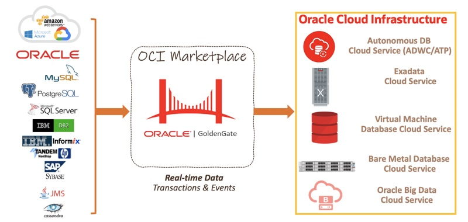
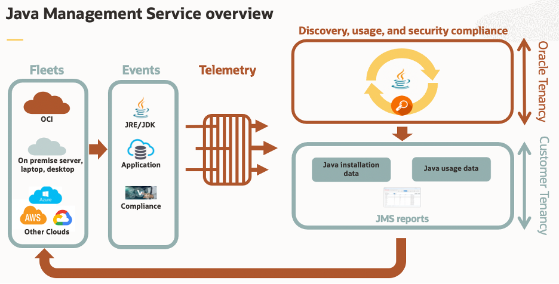
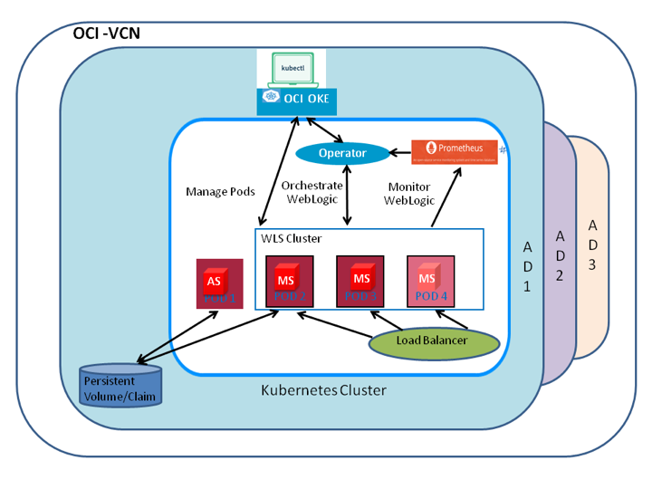
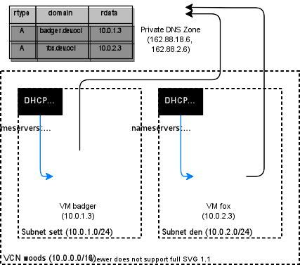
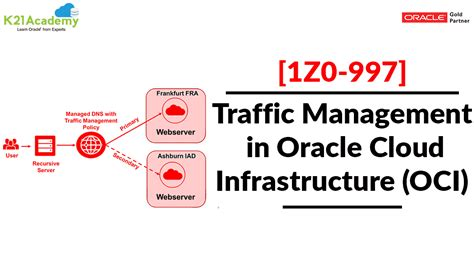
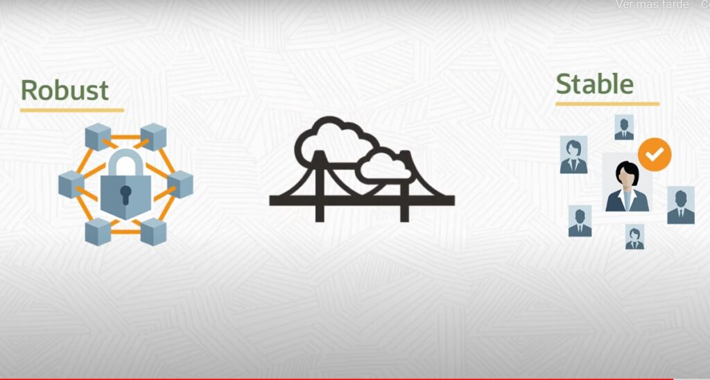
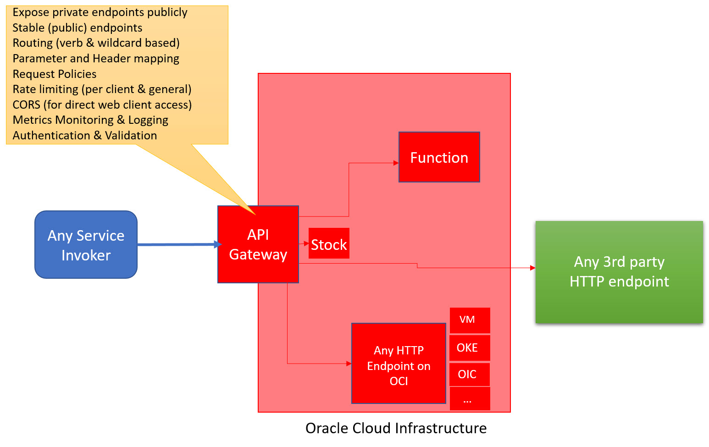

# 02 - Layanan Cloud

## Tujuan Pembelajaran

1. Mengetahui layanan yang ditawarkan cloud computing khususnya Oracle Cloud Infrastructure (OCI)

## Hasil Praktikum

1. Marketplace

Oracle Cloud Infrastructure Marketplace adalah toko online yang menawarkan solusi khusus untuk pelanggan Oracle Cloud Infrastructure. Dalam katalog Oracle Cloud Infrastructure Marketplace, Anda dapat menemukan daftar untuk dua jenis solusi dari Oracle dan mitra tepercaya: gambar dan tumpukan. 

Gambar adalah templat hard drive virtual yang menentukan sistem operasi dan perangkat lunak untuk dijalankan pada sebuah instans. Anda dapat menerapkan daftar gambar pada instance Oracle Cloud Infrastructure Compute. Marketplace juga menawarkan daftar tumpukan. Tumpukan mewakili definisi grup sumber daya Oracle Cloud Infrastructure yang dapat Anda gunakan sebagai grup. Setiap tumpukan memiliki konfigurasi yang terdiri dari satu atau lebih file konfigurasi deklaratif. Dengan gambar atau tumpukan, Anda memiliki cara yang disesuaikan dan lebih ramping untuk memulai dengan perangkat lunak penerbit.

Selain sebagai toko online, Oracle Cloud Infrastructure Marketplace menawarkan cara bagi anggota komunitas Oracle Cloud Infrastructure untuk berbagi gambar kustom dengan anggota komunitas lainnya. Anda dapat mengambil gambar kustom yang Anda impor ke Oracle Cloud Infrastructure Compute dan membuatnya tersedia sebagai aplikasi komunitas.

2. Java Management

Layanan Manajemen Java dapat melacak penggunaan Java yang berjalan di OCI, di desktop lokal, laptop dan server, dan layanan cloud pihak ketiga. Ini memonitor Java Development Kit (JDK), Java Runtime Environment (JRE), dan GraalVM. Agen JMS yang diinstal pada instans terkelola mengumpulkan data telemetri penggunaan Java. Data telemetri disimpan dalam sewa pelanggan untuk perlindungan privasi; tidak ada akses Oracle selain memproses data.

Agen OCI dipasang di sewa pelanggan untuk memantau dan membuat laporan. Hanya pelanggan yang dapat melihat laporan. Oracle tidak dapat melihat data dan tidak membebankan biaya waktu komputasi untuk penggunaan layanan, hanya untuk Pemantauan OCI dan hanya jika penggunaan melebihi ambang batas tingkat gratis Pemantauan OCI.

3. Container Engine

Oracle Cloud Infrastructure (OCI) Container Engine for Kubernetes (OKE) mendukung otentikasi multi-faktor (MFA). Otentikasi multi-faktor menggunakan lebih dari satu faktor untuk memverifikasi identitas Anda. Pendekatan ini memberi Anda opsi untuk meningkatkan keamanan autentikasi ke Kubernetes API menggunakan proses masuk OCI CLI yang sudah kuat dengan memerlukan lapisan verifikasi tambahan untuk identitas Anda.

Saat Anda masuk ke OCI setelah mengaktifkan MFA di layanan OCI Identity and Access Management (IAM), Anda akan dimintai nama pengguna dan kata sandi. Ini adalah faktor pertama. Anda kemudian diminta untuk faktor kedua: kode verifikasi kedua dari perangkat MFA terdaftar yang dapat menghasilkan kata sandi satu kali (TOTP) berbasis waktu.

Hal yang sama berlaku untuk pengguna yang menjalankan perintah menggunakan alat baris perintah Kubernetes, kubectl. Setelah membuat kebijakan IAM yang memerlukan otentikasi MFA untuk mengakses cluster OKE, untuk menjalankan perintah kubectl, pengguna dengan MFA yang diaktifkan harus memperbarui file kubeconfig mereka dan mengautentikasi sesi mereka menggunakan nama pengguna dan kata sandi dan faktor kedua. Pengguna yang tidak melakukannya akan mendapati perintah kubectl mereka gagal. Langkah ekstra ini memungkinkan pelanggan yang sadar akan keamanan dengan persyaratan seputar dukungan untuk otentikasi multi-faktor untuk kluster Kubernetes mereka

4. DNS Service

Layanan Oracle Cloud Infrastructure Domain Name System (DNS) memungkinkan Anda membuat dan mengelola zona DNS Anda. Anda dapat membuat zona, menambahkan catatan ke zona, dan mengizinkan jaringan edge Oracle Cloud Infrastructure untuk menangani kueri DNS domain Anda.

Komponen Layanan DNS

*DOMAIN*

Nama domain mengidentifikasi lokasi tertentu atau kelompok lokasi di Internet secara keseluruhan. Definisi umum "domain" adalah bagian lengkap dari pohon DNS yang telah didelegasikan ke kontrol pengguna. Misalnya, example.com atau oracle.com.

*ZONA*

Zona adalah bagian dari namespace DNS. Catatan Mulai Otoritas (SOA) mendefinisikan zona. Zona berisi semua label di bawahnya sendiri di pohon, kecuali ditentukan lain.

*LABEL*

Label ditambahkan ke nama zona, dipisahkan oleh titik, untuk membentuk nama subdomain. Misalnya, bagian "www" dari www.example.com atau bagian "docs" dan "us-ashburn-1" dari docs.us-ashburn-1.oraclecloud.com adalah label. Catatan terkait dengan domain ini.

*CHILD ZONE*

Child Zone adalah subdomain independen dengan catatan Mulai Otoritas dan Server Nama (NS) mereka sendiri. Zona induk zona anak harus berisi catatan NS yang merujuk kueri DNS ke server nama yang bertanggung jawab untuk zona anak. Setiap Child Zone berikutnya membuat tautan lain dalam rantai delegasi.

*RESOURCE RECORDS*

Sebuah record berisi informasi domain tertentu untuk sebuah zona. Setiap jenis record berisi informasi yang disebut record data (RDATA). Misalnya, RDATA catatan A atau AAAA berisi alamat IP untuk nama domain, sedangkan data MX berisi informasi tentang server email untuk domain. OCI menormalkan semua RDATA ke dalam format yang paling dapat dibaca mesin. Presentasi yang dikembalikan dari RDATA Anda mungkin berbeda dari input awalnya. Untuk informasi lebih lanjut tentang RDATA, silakan lihat Jenis Catatan Sumber Daya DNS yang Didukung.

*DELEGASI*

Server nama tempat DNS Anda dihosting dan dikelola.

5. Traffic Management Service

Layanan Kebijakan Pengarah Manajemen Lalu Lintas Infrastruktur Oracle Cloud adalah komponen penting dari DNS. Kebijakan Pengarah Manajemen Lalu Lintas memungkinkan Anda mengonfigurasi kebijakan untuk menyajikan respons cerdas terhadap kueri DNS, artinya jawaban yang berbeda (titik akhir) dapat disajikan untuk kueri bergantung pada logika yang ditentukan pelanggan dalam kebijakan. Kebijakan Pengarah Manajemen Lalu Lintas dapat memperhitungkan kesehatan jawaban untuk menyediakan kemampuan failover, menyediakan kemampuan untuk memuat keseimbangan lalu lintas di beberapa sumber daya, dan memperhitungkan lokasi tempat kueri dimulai untuk menyediakan mekanisme yang sederhana, fleksibel, dan kuat untuk mengarahkan lalu lintas DNS secara efisien .

Komponen Layanan Traffic Management

*STEERING POLICIES*

Kerangka kerja untuk menentukan perilaku manajemen lalu lintas untuk zona Anda. Steering Policies berisi aturan yang membantu menyajikan jawaban DNS dengan cerdas.

*ATTACHMENTS*

Memungkinkan Anda menautkan kebijakan kemudi ke zona Anda. Lampiran kebijakan pengarah ke zona menutup semua catatan di domainnya yang merupakan jenis catatan tercakup, membangun respons DNS dari kebijakan pengarahnya daripada dari catatan domain tersebut. Sebuah domain dapat memiliki paling banyak satu lampiran yang mencakup semua jenis catatan tertentu.

*RULES*

Kebijakan pengarah pedoman digunakan untuk memfilter jawaban berdasarkan properti permintaan DNS, seperti lokasi geografis permintaan atau kondisi endpoint Anda.

*ANSWER*

Jawaban berisi data catatan DNS dan metadata untuk diproses dalam Steering Policies.

6. Golden Gate

Oracle Cloud Infrastructure GoldenGate adalah layanan cloud asli yang dikelola sepenuhnya yang memindahkan data secara real-time, dalam skala besar. OCI GoldenGate memproses data saat berpindah dari satu atau lebih sistem manajemen data ke database target. Anda juga dapat mendesain, menjalankan, mengatur, dan memantau tugas replikasi data tanpa harus mengalokasikan atau mengelola lingkungan komputasi apa pun.

Konsep GoldenGate Infrastruktur Cloud Oracle
Konsep berikut sangat penting untuk bekerja dengan layanan GoldenGate.

Kompartemen: Mengatur dan mengisolasi sumber daya cloud Anda, seperti jaringan cloud, instans komputasi, volume blok, atau penerapan OCI GoldenGate, dan pendaftaran database. Hanya pengguna dengan izin ke kompartemen yang dapat bekerja dengan sumber daya di dalam kompartemen itu. Kompartemen juga berfungsi sebagai batas keamanan di dalam OCI GoldenGate. Hanya penerapan dan pendaftaran database dalam kompartemen yang sama yang dapat mengakses satu sama lain.

Deployment: Wadah untuk sumber daya OCI GoldenGate Anda, seperti OCI GoldenGate Deployment Console.
Pencadangan Penerapan: Cadangan status penerapan saat ini, disimpan selama 60 hari. Ini dapat digunakan untuk memulihkan penerapan atau membuat penerapan baru dengan status penerapan asli pada saat pencadangan dilakukan.

Pendaftaran Basis Data: Menangkap informasi kredensial sumber dan target dan memungkinkan jaringan antara jaringan cloud virtual (VCN) sewa layanan GoldenGate OCI dan VCN sewa Anda menggunakan titik akhir pribadi. Registrasi database berisi informasi konektivitas ke titik akhir sumber atau target.

Ekstrak: Proses yang berjalan melawan database sumber dan mengekstrak, atau menangkap data.

Jejak: Serangkaian file pada sistem sumber, perantara, dan/atau target tempat Oracle GoldenGate menyimpan perubahan yang ditangkap untuk mendukung ekstraksi dan replikasi perubahan basis data secara berkelanjutan.

Replika: Sebuah proses yang mengirimkan data ke database target. Ia membaca file jejak pada database target, merekonstruksi operasi DML atau DDL, dan menerapkannya ke database target.

7. Security Advisor

Oracle Cloud Infrastructure Security Advisor mendukung dan memperkuat praktik terbaik keamanan Oracle, termasuk persyaratan konfigurasi untuk sumber daya di Zona Keamanan. Ini menggabungkan dan merampingkan alur kerja yang ada untuk secara efisien menciptakan sumber daya yang memenuhi persyaratan keamanan dasar sejak awal.

Secara khusus, Anda dapat menetapkan kunci enkripsi yang dikelola pelanggan baru ke sumber daya pada saat Anda membuat sumber daya, meskipun Anda belum pernah membuat vault atau kunci enkripsi sebelumnya. Zona keamanan memerlukan enkripsi menggunakan kunci yang dikelola pelanggan jika memungkinkan. Karena tidak seorang pun kecuali pengguna yang berwenang yang dapat mengakses kunci, data sensitif hanya dapat didekripsi dan dibaca oleh pengguna yang secara eksplisit diizinkan untuk melakukannya.

Alur kerja yang disederhanakan mengurangi kompleksitas dan pengambilan keputusan. Jika Anda perlu memilih di antara opsi konfigurasi, Penasihat Keamanan hanya menyediakan opsi yang lebih aman. Misalnya, Penasihat Keamanan hanya mengizinkan Anda membuat kunci enkripsi utama yang panjangnya 256 bit. Kunci enkripsi yang lebih panjang memberikan keamanan yang lebih besar daripada yang lebih pendek.

8. API Gateway

Layanan API Gateway memungkinkan Anda untuk memublikasikan API dengan titik akhir pribadi yang dapat diakses dari dalam jaringan Anda, dan yang dapat Anda ekspos dengan alamat IP publik jika Anda ingin mereka menerima lalu lintas internet. Titik akhir mendukung validasi API, transformasi permintaan dan respons, CORS, otentikasi dan otorisasi, serta pembatasan permintaan.

Dengan menggunakan layanan API Gateway, Anda membuat satu atau beberapa gateway API di subnet regional untuk memproses lalu lintas dari klien API dan merutekannya ke layanan back-end. Anda dapat menggunakan satu gateway API untuk menautkan beberapa layanan back-end (seperti penyeimbang beban, instans komputasi, dan Fungsi Oracle) ke dalam satu titik akhir API terkonsolidasi.

Anda dapat mengakses layanan API Gateway untuk menentukan gateway API dan penerapan API menggunakan Console dan REST API.

Layanan API Gateway terintegrasi dengan Oracle Cloud Infrastructure Identity and Access Management (IAM), yang menyediakan otentikasi mudah dengan fungsionalitas identitas Oracle Cloud Infrastructure asli.