# 03 - Infrastructure as a Service (IaaS) - Compute

## Tujuan Pembelajaran

1. Mengetahui layanan Oracle Cloud Infrastructure Compute

2. Mampu membuat Virtual Machine (VM) di layanan compute Oracle Cloud

## Hasil Praktikum

Praktikum: Membuat VM di Oracle Cloud

1. Silakan login ke akun Oracle Cloud Anda masing-masing melalui tautan ini https://www.oracle.com/cloud/sign-in.html

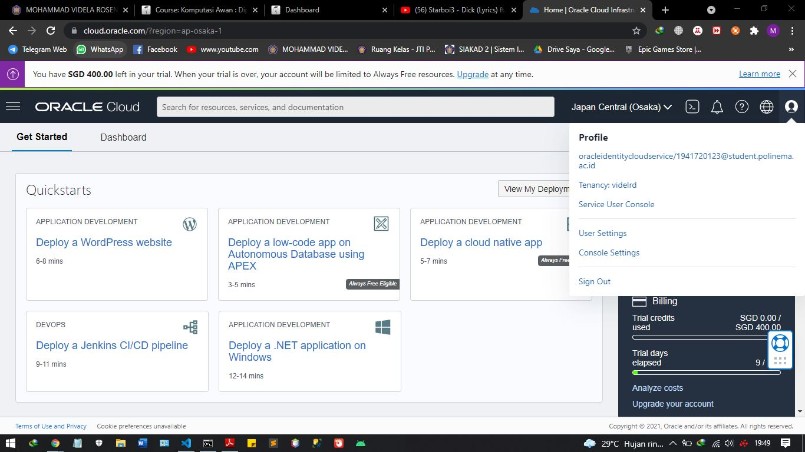

2. Setelah berhasil login dan ada di beranda Oracle Cloud akun Anda, silakan pilih menu di pojok kiri atas, lalu pilih menu Compute > Instances

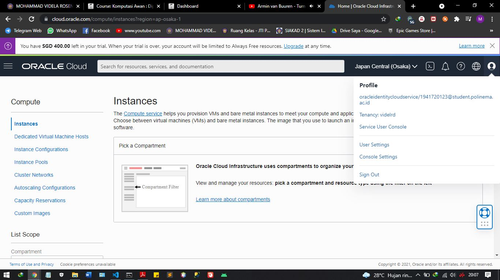

3. Pilih Create instance untuk membuat VM baru. Pada gambar berikut akan tampil nama, status, dll terkait VM yang pernah kita buat. Jika belum ada, berarti VM belum pernah dibuat.

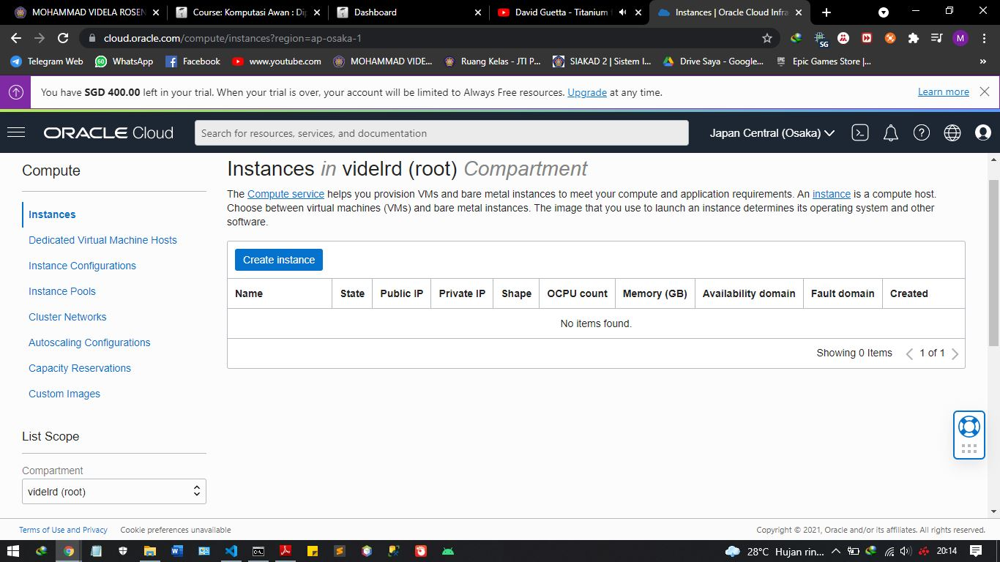

4. Kita beri nama VM sesuai dengan keinginan. Misalnya di sini vm-ubuntu. Untuk compartment biarkan secara default dan placement pastikan Always Free-eligible (biasanya secara default sudah terpilih, jadi tidak perlu diatur lagi)

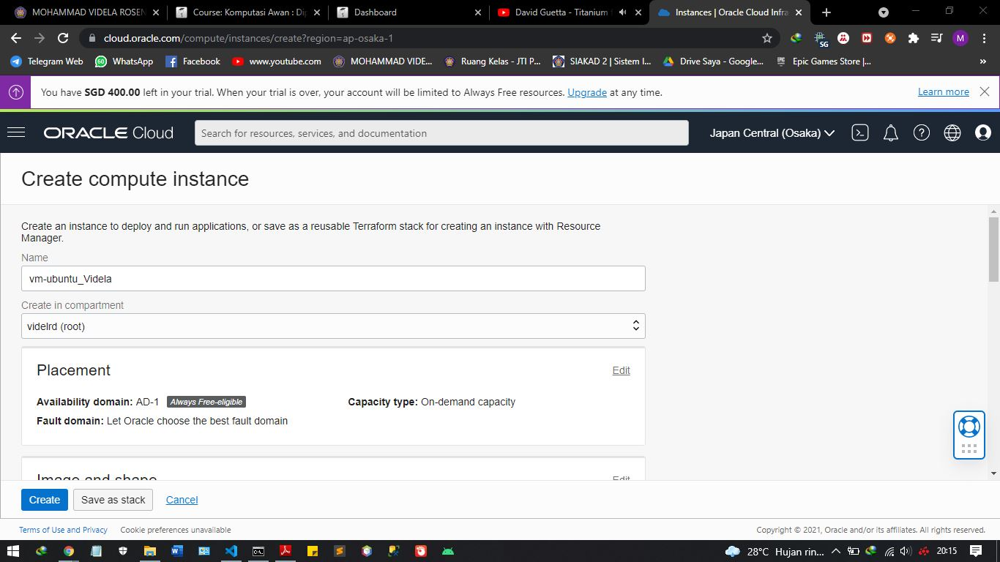

5. Pada bagian Image and shape silakan atur sistem operasi yang akan kita gunakan, ubah menjadi Ubuntu dengan cara klik Edit. Untuk bagian shape biarkan saja, secara default biasanya menggunakan AMD VM.Standard.E2.1.Micro Always Free-eligible dengan 1 core CPU dan 1 GB RAM.

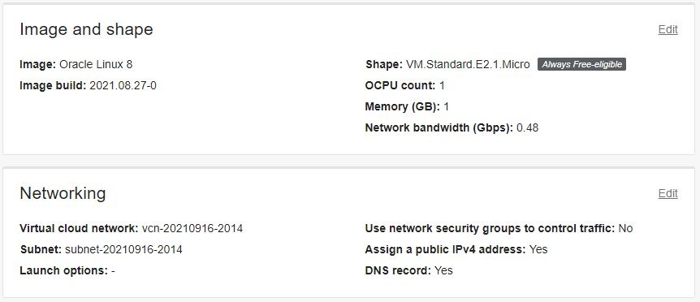

Lakukan perubahan sistem operasi dengan klik Change image. 

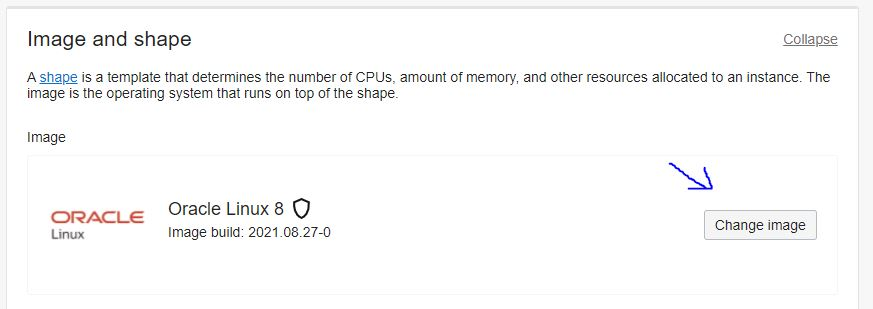
    
Pilih Canonical Ubuntu versi 20.04, lalu klik Select image

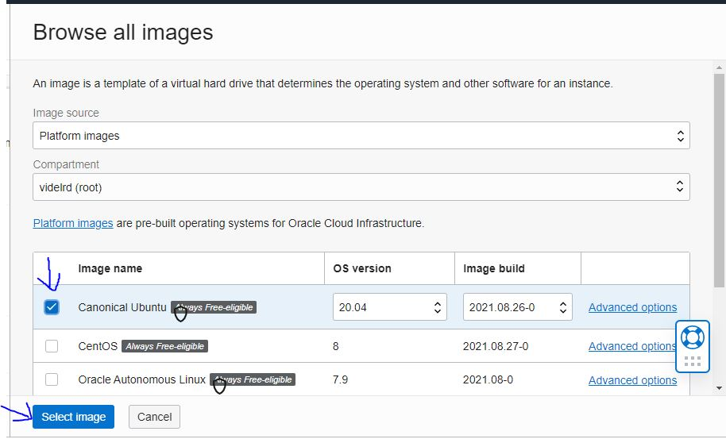

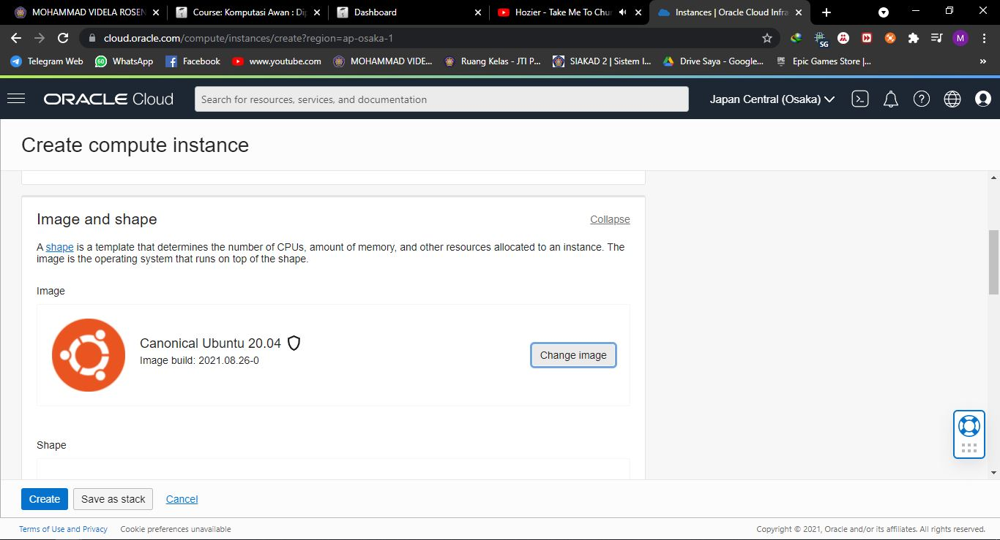

6. Pada bagian Networking biarkan saja pengaturannya. VCN akan dibahas lebih lanjut pada pertemuan berikutnya. Secara default, akses SSH port 21 sudah bisa diakses.

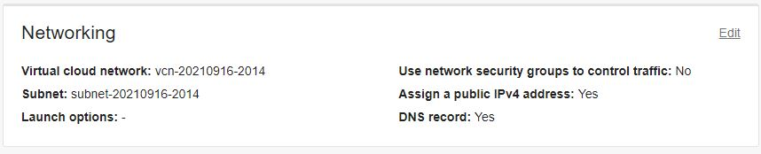

Selanjutnya bagian SSH keys, kita perlu klik Save Private Key untuk mengunduh private key milik kita agar nanti VM bisa diakses

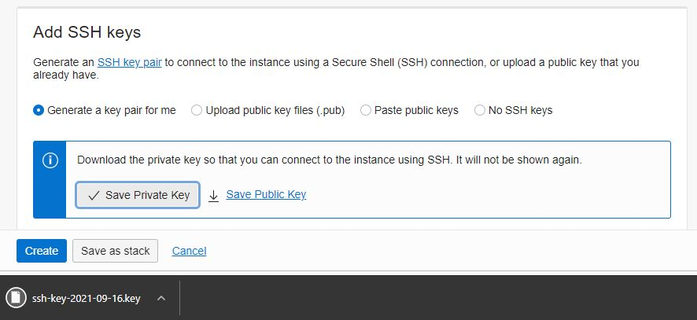

7. Untuk kapasitas disk bisa kita atur sesuai kebutuhan, namun di sini biarkan secara default seperti pada gambar berikut, yaitu disk bervolume 46.6 GB. Langkah terakhir klik Create di pojok kiri bawah untuk memulai membuat VM. Tunggu prosesnya sekitar 2-5 menit sampai tampil status state VM kita adalah running.

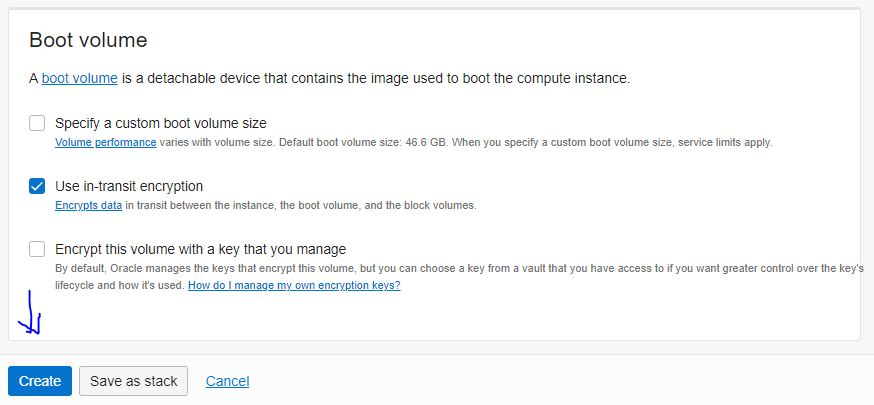

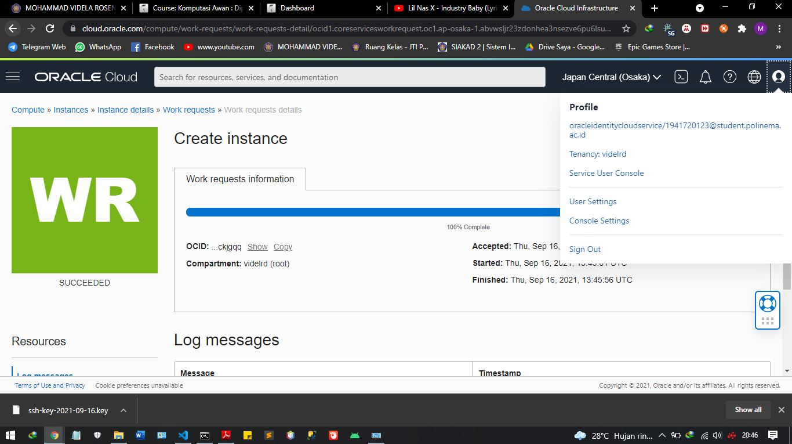

*Tugas*

Carilah cara agar Anda dapat melakukan SSH ke VM yang baru dibuat berdasarkan praktikum tersebut!

Lalu buatlah laporan praktikumnya!

1. Pertama pastikan anda telah menginstall Aplikasi Putty lalu buka PuttyGen maka akan tampil seperti gambar dibawah. lalu anda klik "generate" dan jangan lupa untuk menggerakkan cursor anda agar proses selesai

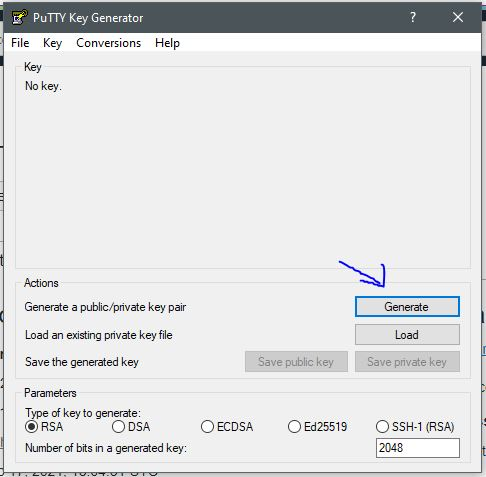

2. setelah proses generate selesai maka akan tampil seperti gambar dibawah. selanjutnya yang pertama anda harus menyimpan "public key" dan "private key" pada komputer / laptop anda, lalu pada "public key for pasting" atau gambar yang dilingkari anda copy terlebih dahulu

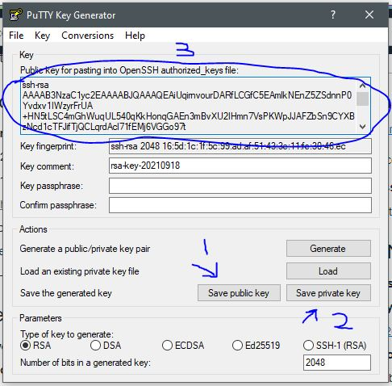

3. Selanutnya buka lagi instance yang telah anda buat sebelumnya lalu scroll ke bagian bawah dan cari pada menu "resources " lalu pilih "console connection". kemudian klik "create local connection". Pada tahap ini berguna untuk membuat sebuah jaringan yang berfungsi untuk menghubungkan antara instance yang telah dibuat dengan device luar

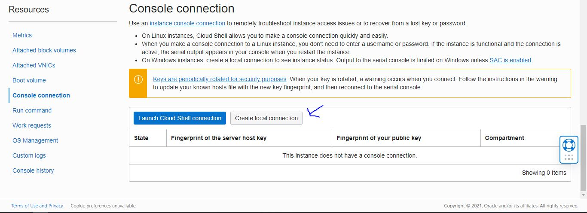

4. Selanjutnya pilih bagian "paste public key" lalu paste yang telah anda copy pada langkah ke 2, lalu klik "create console connection"

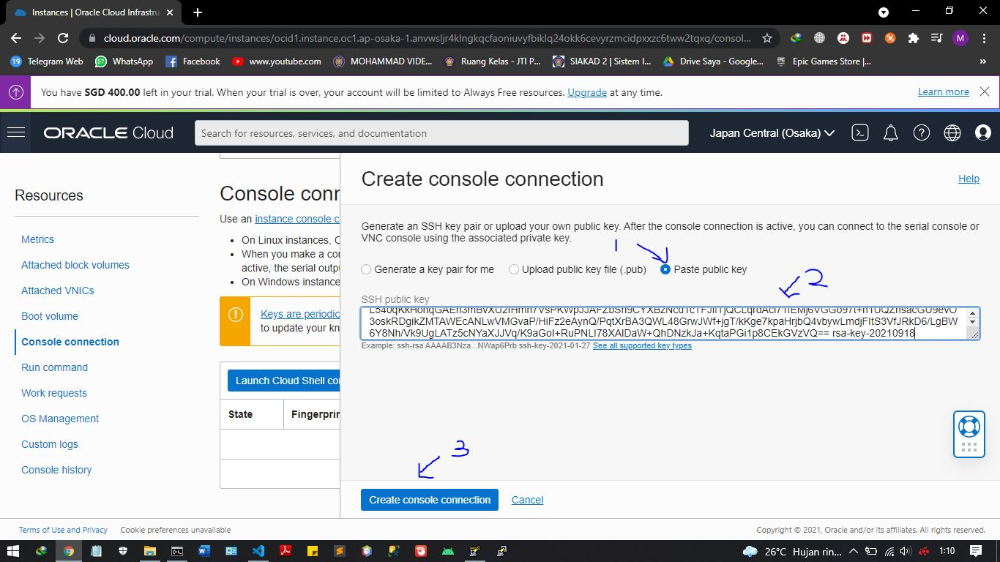

5. Setelah anda klik "create console connection" maka akan muncul sebuah console connetion baru dengan status "active" yang artinya proses berhasil dan dapat dijalankan dengan baik

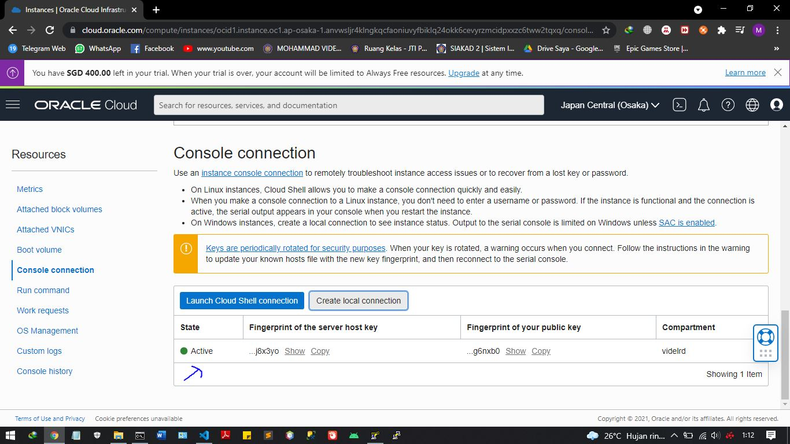

6. Selanjutnya anda buka Putty, lalu pilih "SSH" lalu "Auth" dan pada menu "private key for authentication" silahkan anda masukan "private key" yang telah anda simpan dari langkah ke 2

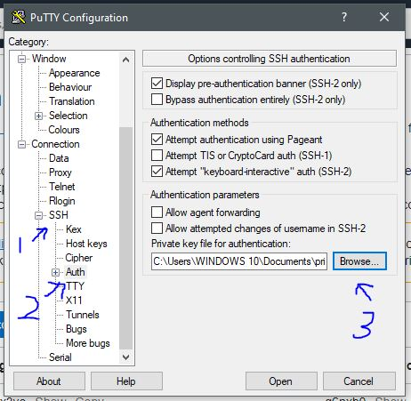

7. Selanjutnya scroll ke atas pada aplikasi Putty dan pilih session, lalu pada bagian "Hostname" silah diisi sesuai dengan IP Address Instance yang telah dibuat pada Oracle Cloud, kemudian klik "open"

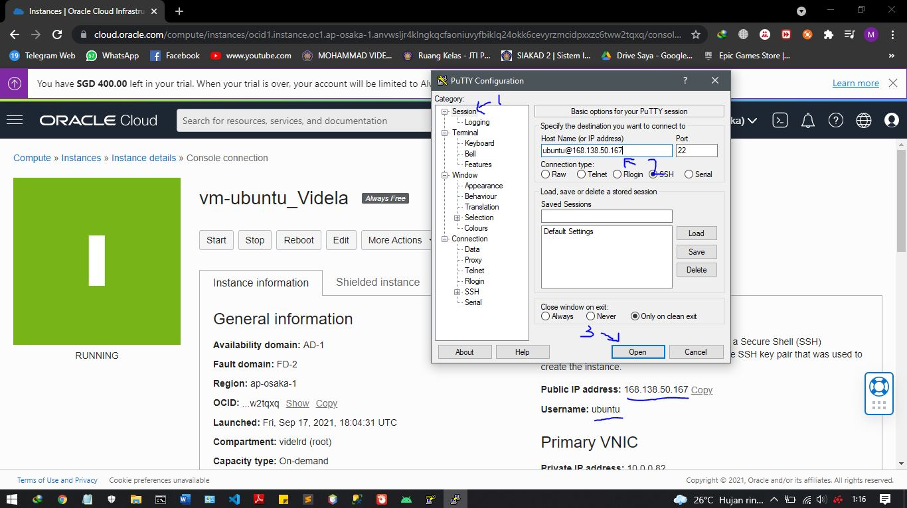

7. Setelah klik "open" maka akan ada peringatan karena ini merupakan pertama kali melakukan koneksi ssh lalu anda klik "yes"

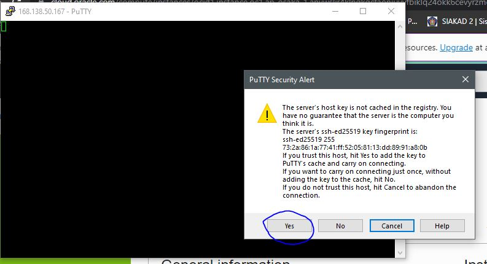

9. Jika berhasil maka akan tampil sesuai gambar dibawah dengan username yang sama antara Instance yang telah dibuat di Oracle Cloud dan di Putty

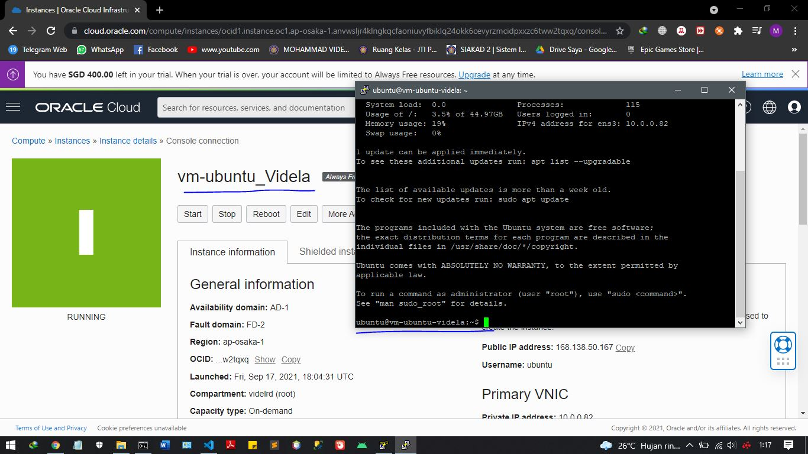
