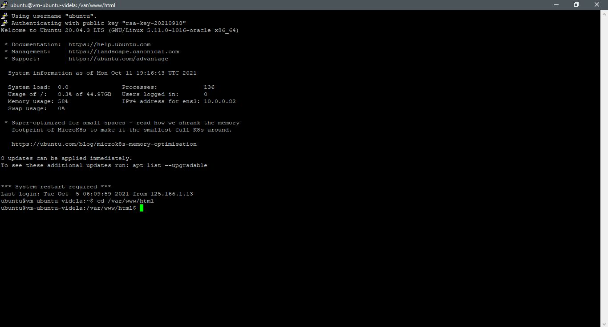

# 05 - PLATFORM AS A SERVICE (PAAS)

## Tujuan Pembelajaran

1. Mengetahui layanan yang ditawarkan cloud computing khususnya Oracle Cloud Infrastructure (OCI)

## Hasil Praktikum

Pada Praktikum PaaS kita tentukan akan menggunakan salah satu layanan PaaS yaitu database. Langkah awal dalam menggunakan salah satu layanan PaaS adalah membuat databases pada OCI. Berikut adalah langkah-langkahnya:

### 1. Membuat Databases

1. Memilih menu Databases MySQL pada OCI.

2. Klik Tombol Create MySQL Database

3. Mengisi Compartment dan Jenis Database Pada praktikum ini kita menggunakan standalone databases, karena kebutuhan database kita masih minimal atau tidak memerlukan spesifikasi yang tinggi

4. Mengisi Data Databases Administrator Pada database administrator menggunakan username dan password sesuai dengan keinginan atau kebutuhan anda

5. Mengkofigurasi VCN Konfigurasi VCN pada database disesuaikan dengan tujuan instances yang akan dikoneksikan dengan database.

6. Mengkofigurasi Availability Domain Untuk Availibility Domain dari database yang akan kita gunakan tidak bisa dipilih pada akun yang gratis, sehingga tidak perlu untuk diubah.

7. Mengkofigurasi Shape dari Database Pada praktikum ini menggunakan shape yang minimal karena belum memiliki kebutuhan sistem yang memiliki spesifikasi yang tinggi.

8. Mengkofigurasi Backup dari Database dan Menekan Tomboh Create Database Untuk backup dari database dapat tidak disetting disesuaikan dengan kebutuhan. Setelah semua pengaturan dianggap telah cukup maka pada tahap akhir adalah menekan tombol create database.

9. Setelah menekan tombol create database maka status database adalah Creating, jadi tunggulah beberapa saat sampai status database Active.

10. Tampilan saat sampai status database Active.

### 2. Mengkonfigurasi Virtual Cloud Networks (VCN)

Setelah membuat database pada langkah selanjutnya adalah mengkonfigurasi VCN karena Endpoint dari database bersifat private. Langkah-langkah yang dilakukan adalah sebagai berikut:

1. Memilih menu VCN pada Networking

2. Memilih menu Security List

3. Menambah Rules pada Security List

### 3. Mengakses MySQL dari Melalui SSH

Untuk mengakses mysql yang telah buat dengan cara sebagai berikut:

Cara untuk mengakses instances yang dimiliki melalui ssh adalah dengan mengetik perintah sudo ssh -I username@ip public. Contoh penggunaan perintah tersebut adalah adalah sebagai berikut:

1. Buka aplikasi PuTTY Configuration untuk menghubungkan vm ke aplikasi putty kemudian masukkan username@IP

2. Selanjutnya pada menu SHH > Auth masukan configurasi private ip yang sudah disave.

3. Lalu pilih browse untuk mencari file private key didalam folder lalu klik open

4. Setelah sudah memasukan configurasi private ip lalu klik open lalu lakukan login

5. Setelah berhasil masuk ke instances yang dimiliki anda dapat mengakses mysql anda akan tetapi anda harus menginstall mysql client. Jika anda tidak memiliki mysql client maka anda akan mendapat pesan seperti berikut:

6. Lalu anda install package mysql dengan perintah seperti berikut:

7. Untuk mengkoneksikan mysql dengan perintah berikut mysql -u <database administrator> -p -h <ip private mysql oci /hostname>. Setelah ini database sudah siap untuk digunakan sesuai dengan kebutuhan anda

### 4. Install Wordpress Pada PaaS

Cara untuk menginstall wordpress pada OCI dapat menggunakan langkah-langkah seperti berikut:

1. Membuat Database
Cara untuk membuat database pada mysql adalah dengan mengetik perintah di bawah ini.Perintah
pertama untuk membuat database, perintah kedua untuk melihat apakah database kita sudah berhasil
dibuat dan ketiga adalah memberikan previleges database pada user admin. Anda dapat membuat
user baru dan mengatur previlegenya.

2. Download Wordpress Pada Folder /var/www/html dengan perintah

3. Mengetrak Wordpress Pada Folder /var/www/html dengan perintah

4. Selanjutnya menginstall extension mysql pada php dan mengaktifkannya pada php.ini.
Berikut adalah perintah untuk menginstall extenstion mysql pada php.

Sedangkan cara untuk mengaktifkan extension mysql pada php dapat diaktifkan pada php.ini. Path
dari php.ini dapat dilihat pada phpinfo() seperti pada gambar berikut terletah pada
/etc/php/7.4/apache2/php.ini.

Pada php.ini aktifkan extension=php_mysqli.dll kemudian lakukan restart apache menggunakan
perintah berikut.

5. Selanjutnya Proses Intalasi Wordpress Melalui Browser

### 6. Tugas

1. Cari sebuah website yang terdapat sebuah database

2. Lalu sambungkan ke server yang kita miliki

3. Kemudian install git dengan perintah seperti dibawah

4. Selanjutnya kita buat database sesuai nama project yang kita miliki

5. Selanjutnya kita gunakan database yang telah dibuat tadi dengan perintah seperti dibawah

6. Buat tabel sesuai yang ada didalam folder database

7. lalu clone project kedalam folder /var/www/html dengan perintah seperti dibawah

[Screenshot Langkah 42](img/langkah42.JPG)

8. lalu rubah koneksi database seperti dibawah

[Screenshot Langkah 43](img/langkah43.JPG)