### 4. Install Wordpress Pada PaaS

Cara untuk menginstall wordpress pada OCI dapat menggunakan langkah-langkah seperti berikut:

1. Membuat Database
Cara untuk membuat database pada mysql adalah dengan mengetik perintah di bawah ini.Perintah
pertama untuk membuat database, perintah kedua untuk melihat apakah database kita sudah berhasil
dibuat dan ketiga adalah memberikan previleges database pada user admin. Anda dapat membuat
user baru dan mengatur previlegenya.

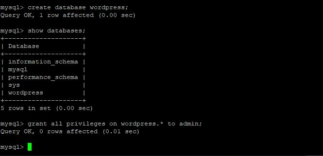

2. Download Wordpress Pada Folder /var/www/html dengan perintah

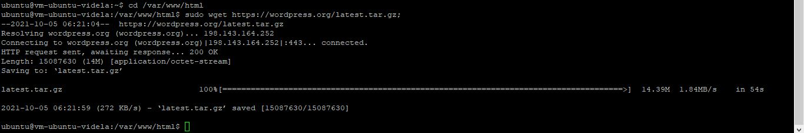

3. Mengetrak Wordpress Pada Folder /var/www/html dengan perintah

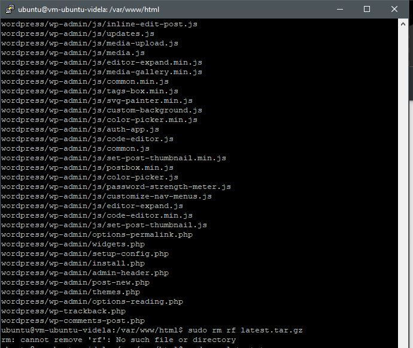

4. Selanjutnya menginstall extension mysql pada php dan mengaktifkannya pada php.ini.
Berikut adalah perintah untuk menginstall extenstion mysql pada php.

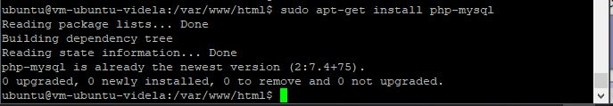

Sedangkan cara untuk mengaktifkan extension mysql pada php dapat diaktifkan pada php.ini. Path
dari php.ini dapat dilihat pada phpinfo() seperti pada gambar berikut terletah pada
/etc/php/7.4/apache2/php.ini.

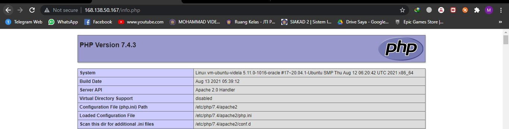

Pada php.ini aktifkan extension=php_mysqli.dll kemudian lakukan restart apache menggunakan
perintah berikut.

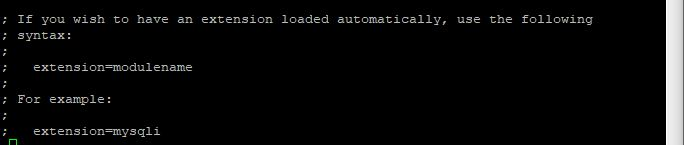

5. Selanjutnya Proses Intalasi Wordpress Melalui Browser

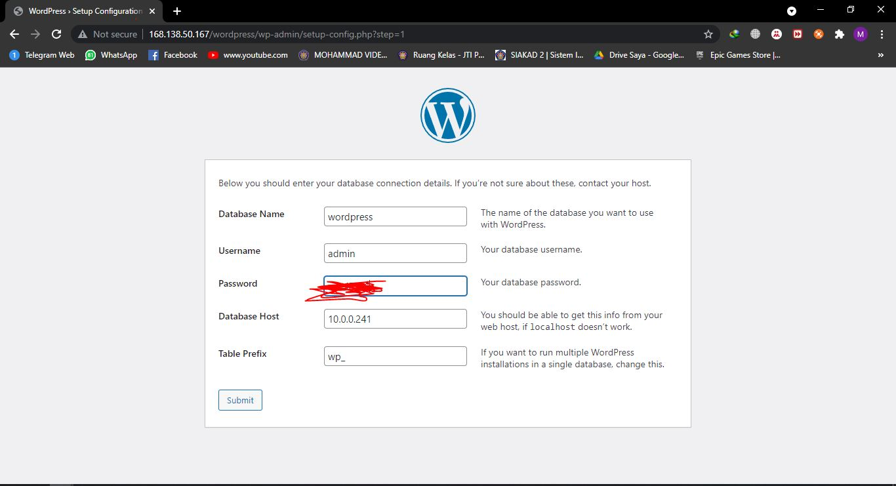
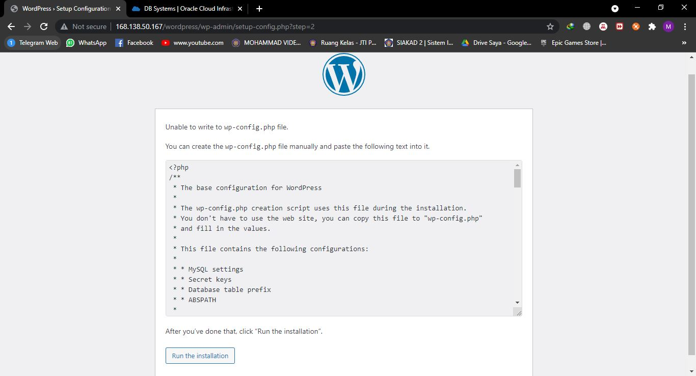
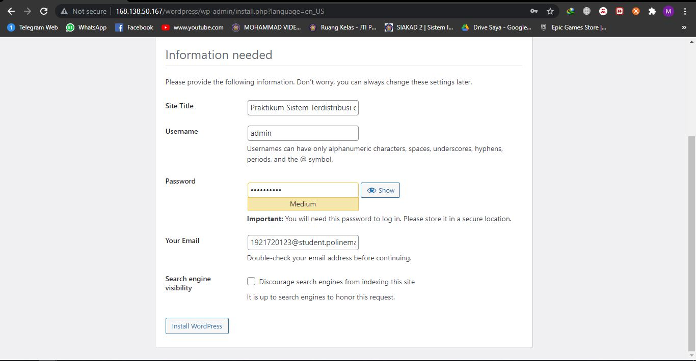
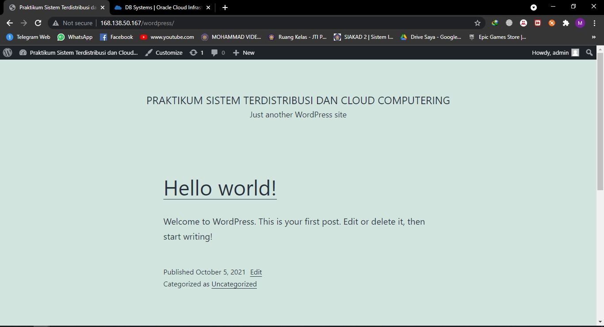
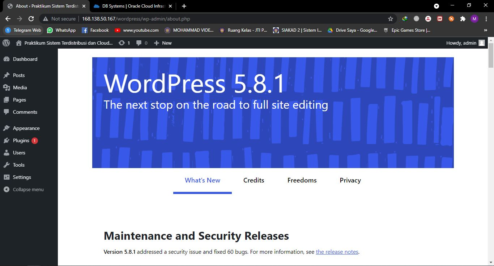