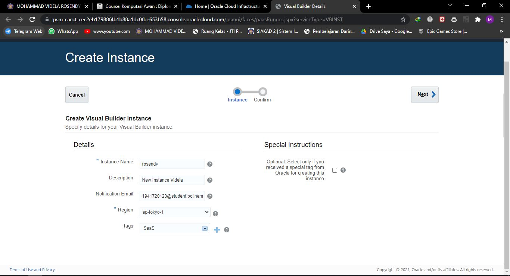
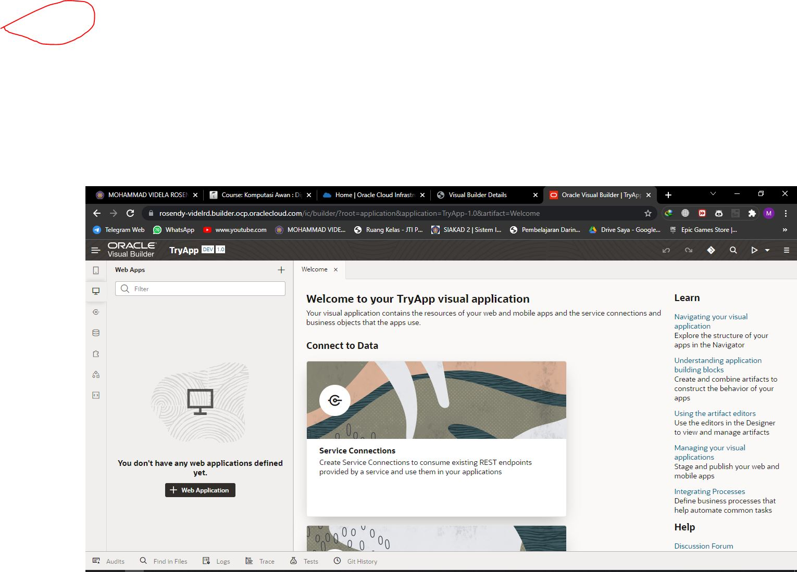
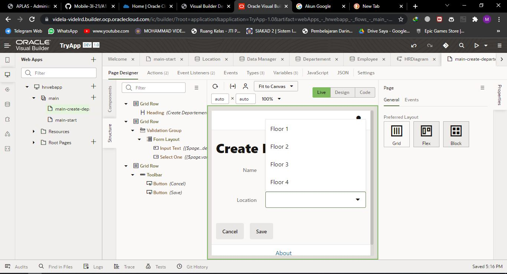
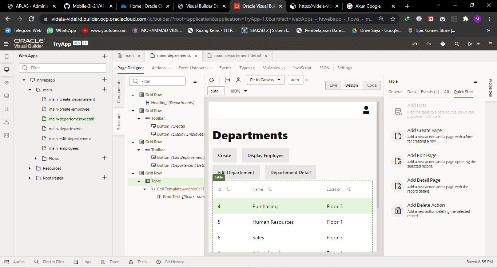
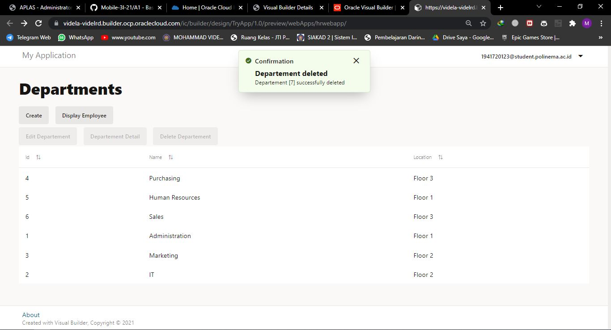

# 07 - SaaS (Software as a Service)

## Tujuan Pembelajaran

1. Mengetahui layanan Oracle Cloud Infrasturcture Software as a Service.

2. Mampu mengguankan layanan software layanan oracle

## Hasil Praktikum

Oracle Visual Builder adalah alat pengembangan untuk membuat aplikasi web dan seluler dengan
menyeret dan menjatuhkan komponen pada halaman. Komponen ini bergantung pada objek bisnis
untuk datanya. Objek bisnis hanyalah sumber daya -- seperti pesanan pembelian atau faktur -- yang
memiliki bidang untuk menyimpan data untuk aplikasi Anda. Objek bisnis mirip dengan tabel
database, karena menyediakan struktur untuk data Anda; pada kenyataannya, objek bisnis disimpan
dalam database. Aplikasi web Anda mengakses objek bisnis melalui titik akhir REST mereka.
Pada parktikum ini kita akan mencoba membuat sebuah bisnis object seperti pada gambar dibawah
ini:

Setelah Kita memiliki objek bisnis, kita akan menggunakannya untuk membangun aplikasi Sumber
Daya Manusia (Human Resoruce Application) yang sangat sederhana di mana setiap karyawan
menjadi bagian dari sebuah departemen, dan setiap departemen memiliki lokasi. Hasil akhir dari
project ini pengguna bisa menambahkan nama karyawan dan departemen mereka ke database, dan
mengubah data jika diperlukan.

Alat dan bahan:

• Visual builder
• Browser

### Membuat Aplikasi (Create Web Application)

1. Membuat Aplikasi (Create Web Application)
Login OCI -> Pilih OCI Classic Service -> Create Instace

OCI Classic Service -> Create Instace

Isi nama instace, nama, deskripsi dari instance, Region dan tak

Hasil instance yang telah dibuat:

Lihat pada pojok kiri, terdapat simbol menu (klik simbol tersebut dan akan muncul menu beriku),
Kemudian pilih Open Visual Builder Home Page

Tunggu beberapa saat, kemudian jika berhasil akan muncul halaman berikut. Klik New Application

Isi informasi tentang aplikasi yang akan dibuat :

Jika kita berhasil membuat akan muncul nama aplikasi yang akan kita buat seperti gambar dibawah ini:

Klik nama aplikasi yang telah kita buat (seperti pada gambar sebelumnya), maka akan muncul
halaman berikut:

Pada sisi kiri adalah menu dari (kotak berwarna merah) visual builder dari aplikasi yang akan kita
buat, pilih ikon web kemudian akan muncul menu berikut :

2. Pada dialog box Create Application, isi nama web dengan nama “hrwebapp” dan untuk novigation style biarkan none.

3. Expand hrwebapp, kita akan melihat struktur struktur dari aplikasi web, kurang lebih seperti gambar dibawah ini:

### Import Location Busines dari file

Pada tahap ini kita akan membuat object busines location dan melakukan import data.

1. Klik Busines Object , pada tab navigator:

2. Klik tombol + Busines Object.

3. Pada dialog box Busines Object, isi field label dengan “Location” kemudian tekan tombol create (pada field name akan otomatis terisi).

4. Klik Field tab

5. Klik + Field untuk menambahkan Busines Object

6. Ketika pup-up box, masukan

• Label: Name
• Field Name: name (automatically populated)
• Type: String String (selected by default)

7. Pada property instpector, centang Required di bawah label constrain.

8. Klik Menu icon dan pilih Data Manager (Data Manager bisa kita gunakan untuk mengimpor data dari berbagai sumber)

9. Pilih Impor From File.

10. Di kotak dialog Impor Data, klik kotak impor, pilih Location.csv, dan klik Impor. Ketika impor berhasil, klik Tutup.

11. di panel Bisnis Object, klik Location, lalu klik tab Data untuk melihat Location

### Department Business Object

1. Pada panel Business Objects, klik tanda +, lalu pilih Business Object

2. Pada new Business Object dialog Box, Pada field label isi dengan “Department”.

3. Klik Fields tab kemudian klik + Field.

4. Pada pop-up box, masukan:
• Label: Name
• Field Name: name (automatically populated)
• Type: String String icon (selected by default)
• Click Create Field.

5. Pada property instpector, centang Required di bawah label constrain.

6. Klik Fields tab kemudian klik + Field
Label: Location
Field Name: location (automatically populated)
Type: Reference Reference icon
Referenced Business Object: Location
(Reference field seperti foreign key pada database table)
Display Field: Name (automatically populated)

### Employee Business Object

Pada langkah ini, kita akan membuat objek bisnis terakhir yang kita butuhkan, objek Karyawan, yang
berisi nama karyawan dan data pengenal. Dalam hal ini, Karyawan memiliki bidang Referensi yang
merujuk ke Departemen

1. Pada panel Bisnis oject, klik tanda +, lalu pilih Bisnis Objek.

2. Pada new Business Object dialog Box, Pada field label isi dengan “Employee”.

3. Klik Fields tab kemudian klik + Field.

4. Pada pop-up box, masukan:
• Label: Name
• Field Name: name (automatically populated)
• Type: String String icon (selected by default)
Click Create Field.

5. Pada property instpector, centang Required di bawah label constrain.

6. Pilih + Fields, kemudian mauskan atau isi:
• Label: Department
• Field Name: department (automatically populated)
• Type: Reference Reference
• Referenced Business Object: Department
• Display Field: Name (automatically populated)
Klik Create Field.

7. Pilih + Fields, kemudian mauskan atau isi:
• Label: Hire Date
• Field Name: hireDate (automatically populated)
• Type: Date Date
Klik Create Field.

8. Pilih + Fields, kemudian mauskan atau isi:
Label: Email
Field Name: email (automatically populated)
Type: Email Email
Klik Create Field, Di editor properti, Format diatur ke Email.

9. Klik tab Endpoints dan lihat API resource dan REST end point yang dibuat untuk Business Object
Empoyee. Karena Object Employee merujuk ke Department, kita dapat melihat end point untuk
kedua objek terseut jika Anda memperluas node departmentObject. Perluas node Resource API
untuk melihat URL untuk mengakses metadata dan data untuk objek bisnis, lalu perkecil lagi.

10. Di panel Objek Bisnis Navigator, klik tab Diagram, lalu klik tombol + busines object diagram.

11. Pada Create Business Object Diagram dialog box, isi field Diagram name dengan “HRDiagram”.

12. Pada properti inspector, pilih semua

Kurang lebih diagram yang dihasilkan seperti ini:

### main-start Page untuk Display Departments

1. Pilih Web Applications pada tab navigator.

2. Expand main nodes

3. Perhatikan pada componen palette, tempatkan Heading komponen pada bagian common

kemudian drag (heading) ke halaman.

4. Pada heading property inspector, isi text field dengan “ Departments”

5. Pada components palette, scroll down sampai menemukan collection, pilih table, kemudian drop di bawah heading (departement).

6. Klik Add Data di Property Inspector untuk membuka Add Data Quick Stats

7. Pada halaman Quick Start, pilih busines object Departemen, lalu klik next.

8. Pada halaman Bind Data, di bawah item[i], centang id dan nama.

9. Perluas node locationObject dan item dan pilih name untuk mengaktifkan location name agar muncul di tabel. Klik next.

10. Pada halaman Query Page, klik Finish.

11. Untuk membuat kolom nama lokasi deskriptif, klik Data tab. dibawah Table (side menu bar sebelah kanan), klik ikon Detail arrow disebelah Name (locationObject)

12. Pada kolom, Header text field, ubah “Name” menjadi “Location”. Kemudian klik untuk kembali ke sub menu Data tab.

### Page untuk Department Business Object

Halaman create memungkinkan kita untuk mengisi tabel dengan data dengan membuat instance baru dari busines object.

1. Klik ta Quick Start (side menu sebelah kanan), kemudian klik Add Create Page.

2. Kemudian pada halaman End point, pilih busines object Department, kemudian pilih next.

3. Pada halaman detail page, dibawah endpoint structure, pilih dan centang location.

4. Isi field Button label dengan “Create”. Kemudian klik tombol Finish,

Setelah kita tekan tombol finish, akan muncul komponen tombol Create di atas tabel di halaman
awal utama. Klik tab Web Application (side menu sebelah kiri) untuk melihat halaman maincreate-
department yang berada dalam satu list main-start.

5. Klik main-create-department dan buka Page Designer. Pada halaman tersebut kita bisa melihat ada 2 filed sama seperti langkah ke-4. Selain itu terdapat 2 tomol Cancel dan Save.

6. Pada halaman Quic Preview klik Live, pada mode ini kita bisa mencoba apakah form yang kita buat sudah berjalan atau tidak.

7. Pada field Name ise dengan “Administration” dan untuk lokasi pilih Floor 1.

Kemudian klik Save, maka akan muncul pesan dan Oracle Visual Builder akan mengarahkan kita
ke halaman flow diagrarm dari halaman yang kita buat.

8. Buka, halaman main-start, bisa kita lihat data pada tabel telah ditambahkan.

### Menambah Halaman Display Employees

Pada bagian ini, Kita akan membuat halaman untuk menampilkan Employee, prosesnya mirip dengan
pada langkah sebelumnya (membuat halaman departement).

1. Pada main klik simbol + pada main node.

2. Pada dialog box Creating Page, masukkan " employees” setelah prefix main-, kemudian klik create.

3. Kemudian tambahkan Heading pada halaman main-employess, dengan cara melakukan drop komponen heading ke halaman main-employess.

4. Ganti filed text pada side menu (sebelah kanan) properties Heading dengan “ Employees”

5. Kemudian tambahkan komponen Table pada halaman main-employess.

6. Klik Add Data.

7. Pada menu pop-up add data, pilih busines object Employee, kemudian pilih next.

8. Untuk filed data pilih id, name, hireDate, dan Email.

9. Expand departmentObject -> item nodes, pilih name, kemudian pilih next.

10. Kita bisa melewat halaman Define Quire, pilih Finish.

11. Kembali ke menu properties pilih tab Data, dibawah table column name (paling bawah) klik pada field columnt header text isi dengan ” Department”.

12. Klik untuk kembali ke Data tab.

### Halaman Create untuk Employee Busines Object

1. Quick Start, klik Add Create Page.

2. Pilih end point Employee.

3. Untuk filed pilih hireDate, email, dan departement (name otomatis dipilih karena required field).

4. Pada field Button Lable isi dengan Create, klik finish.

5. Klik live, kemudian masukan data name: Lasile Smith, Hire Date: (today), email: lsmith@example.com Departmet: Administration. Kemudian pilih Save. Setelah itu kita akan diarah ke halaman Page Flow. Ketika kita kembali ke halaman main-employess akan tampil data yang telah kita isikan (jika tidak tampil klik tombol reload page ).

6. Klik Code untuk melihat kode HTML dari halaman main-employess.

7. Klik Design untuk kembali ke halaman main-employees, kemudian klik Structure

8. Klik Structure lagi untuk menutup structure view.

### Mengganti Nama Halaman main-start

1. Pada Side menu (Web Apps) klik kanan pada main-start, kemudian pilih rename.

2. Pada pop-up menut, pada filed ide Ganti nama start dengan departments, sehingga akan menjadi seperti:

3. Double klik pada main-departments.

4. Klik Source View expand webApps, hrwebapp, flows, dan main nodes. Kemudian klik mainflow.json

### Action Chain halaman Departments ke halaman Employess

1. Tambahkan Button pada halaman main-departments, beri nama botton “Dispalay Employee”.

2. klik + New Event (side bar properties), pilih Quick Start: ‘ojAction’, setelah di klik sebuh action chain akan dibuat dengan nama ButtonActionChain, berisi Start action.

3. Drag Navigate action dari Navigation section yang ada di Action Palatte ke tanda + dibawah action start.

4. Pada Navigate Property insptector, Pada filed Target pilih main-employees.

5. Klik Preview . di header untuk menguji halaman dan navigasi. Applikasi akan membuka browser tab yang lain, click Crate dan tambahkan data departemetn (contoh: IT -> Floor 2). Kemudian klik Save.

6. Klik Display Employees Page, kemudian klik Create. Tambahkan data employee sesuatikan dengan nama departemet yang baru dibuat.

### Action Chain halaman Employess ke halaman Departments

1. Untuk proses action chain halaman employees ke halaman departments sama dengan pada langkah sebelumnya, berinama tombol “Display Departments”. Untuk Navigate Page “Navigate maindepartments”.

2. Klik Preview .

3. Klik main -> Page Flow, akan muncul diagram kurang lebih seperti berikut:

### Import Data ke Busines Object

1. Pada Navigator, Pilih tab Busines Object , kemudian klik Object tab.

2. Klik Departement kemudian klik Data tab, kemudian akan tampil jenis object yang telah kita buat tadi.

3. Klik Import from File .

4. Pada dialog-box import data, pilih Replace untuk Row Handling jika belum dipilih. Kemudian klik upload box, browse, pilih file Departement.csv dan klik Import.

5. Ulangi langkah yang sama (langkah 1-4) untuk import data Employee menggunakan file Employee.csv.

### Halaman Edit Department Busines Object (data manipulation)

1. Pada aplikasi HR Application, tab Web Application pilih halaman main-departments -> Page Designer. Klik Reload Page jika diperlukan, untuk menampilkan update halaman terbaru (setelah import data).

2. Klik komponen table yang ada di halman main-departments, kemudian pada properties (side menu sebelah kanan) pilih Quick Start, klik Add Edit Page.

3. Untuk halaman end point, pilih business object Department, kilik Next.

4. Untuk update end point, pilih businees object Departmetn, kemudian klik Next.

5. Pada halaman Page Details, pilih location dibawah struktur Endpoint (name otomatis akan dipilih), klik Finish. Tombol Edit Department akan tampil pada halaman main-department, tetapi halaman tersebut masih belum aktif.

### Halaman Detail untuk Department Busines Object

1. Pilih Quick Start menu, klik Add Detail Page.

2. Pilih halaman end point business object Department,

3. Pada Page Detail, pilih name dibawah EndPoint Structure, expand locationObject dan items (item[i]) pilih name, klik Finish. Tombol Department Detail akan ditampilkan pada toolbar yang ada pada halaman main-department, untuk saat ini tombol tersebut masih belum aktif

4. Klik Live, pilih data (terserah), klik tombol Departement Detail untuk membuka halaman maindepartment.

5. Klik Design untuk kembali ke mode Desain.

6. Klik main-department-detial, pilih Name (paling bawah), ganti label menjadi Location (Properties -> General -> Label Hit)

### Halaman Delete untuk Department Busines Object

1. Kembali ke halaman main-department, klik Quick Start kemudian klik Add Delete Action.

2. Pilih Endpoint busines object Department,

3. Tombol Delete Department akan ditampilkan pada toolbar, kondisi tombol akan berada pada inactive.

### Test Fungsi Halaman Department Busines Object

1. Lakukan test pada setiap tombol yang telah Anda buat dengan menggunakan mode review.

2. Cobalah menambahkan Data, Update, dan menghapus data.

> Create

> Detail

> Update

> Delete

### Employee Business Object

1. Tambahkan halaman edit, detail dan delete pada halaman busines object Employee.

2. Preses pembuat halaman sama dengan langkah sebelumnya, Pilih Quick Start (Add Edit Page dan Delete Action Page.

3. Untuk page details pada busines object employee pilih name (otomatis dipilih) hireDate, email dan department.

4. Set agar tampilan pada halaman Edit employe menjadi seperti ini (2 row):

5. Untuk field detal page pilih name, hireDate, email. Expand departmentObject -> items -> name. Klik Finish.

6. Ganti label name (yang ke dua/paling bawah) pada halaman Employee Detail menjadi Department (Properties-> General -> Label Hint).

7. Tambahkan halaman Delete Employee dengan menggunakan objct busines Employee, sehingga tampilan akhir dari main-employee menjadi seperti dibawah ini:

### Test Fungsi Halaman Employee Busines Object

3. Lakukan test pada setiap tombol yang telah Anda buat dengan menggunakan mode review.

4. Cobalah menambahkan Data, Update, dan menghapus data.

> Create

> Detail

> Edit

> Delete

### Stage and Publish

#### Stage

1. Kembali ke halaman utama Visual Builder.

2. Pada aplikasi yang telah dibuat klik Options , kemudian select Stage.

3. Pada popup-box pilih Populate Stage with Development data kemudian klik Stage.

Application stage berubah dari development ke stage.

4. Klik Stage, pilih hrwebapp (nama apliaksi web yang kita buat). Setelah kita klik akan membuka tab baru pada web browser yang kita gunakan. Pada halaman yang baru dibukan akan ada data yang kita tambahkan pada saat development.

#### Publish Application

Setelah kita berhasil menguji aplikasi pada tahab sebelum, kita dapat mempublikasikannya dan
membuat aplikasi live. Aplikasi langsung dapat dilihat oleh pengguna dengan kredensial yang tepat.

1. Klik ikon menu dan select Publish.

2. Pada pop-up box select Include data from Stage dan klik Publish.

3. Klik OROCLE Visual Builder untuk kembali Visual Applications page.

4. Klik Live dan pilih hrwebapp. Aplikasi akan membuka tab browser baru.

Data akan secara otomatis terisi dengan data saat kita melakukan stage, tetapi jika ingin memulai
aplikasi dengan database yang kosong kita bisa memilih Publish application with a clean
database.

5. Catat link dari aplikasi yang telah kita buat, dari link tersebut kita membagikannya ke Public User.

https://videla-videlrd.builder.ocp.oraclecloud.com/ic/builder/rt/TryApp/live/webApps/hrwebapp/
