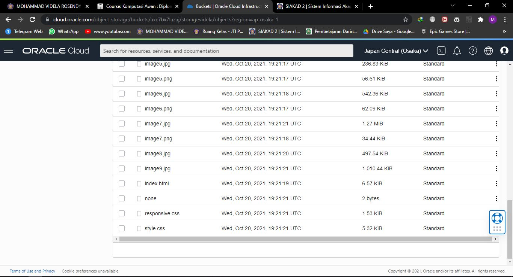

# 08 - Object Storage

## Tujuan Pembelajaran

## Hasil Praktikum

Pada praktikum kali ini kita akan membuat sataic website kemudian menghostinya ke Oracle Object
Storage. OCI memiliki free tier, salah satunya adalah object storage yang bisa digunakan untuk
menyimpan file dan berjalan pada protokol https.

1. Membuat bucket untuk website. Sign-in ke OCI kemudian pilih Object Storage.

Create Bucket ¨ Pilih standar bucket.

Untuk free tier mendapatkan gratis 10 GB Object Storage dan 10 GB archive storage (jika
penggunaan lebih dari 20 GB dan tidak melakukan upgrade dari free trial maka otomatis data akan
dihapus).

(Bucket Name → bebas)

Buka bucket dengan melakukan klik pada nama bucket kemudian pilih Edit Visibility. Pilih Visibility
menjadi Public. Tekan Save Changes untuk menyimpan perubahan.

2. Uploading web page. Pada bagian bawah dari Bucket Information terdapat box Object (upload semua file yang ada pada folder colorFliper)

Setelah upload index.html file ¨ Klik titik 3 pada sisi kiri file index.html.

Kemudian pilih View Object Detail (Panel detail akan menunjukkan detail URL objek)

Kemudian pilih URL Path (URI) untuk membuka file

Jika file yang di upload berhasil tampilan pada halaman akan seperti pada gambar di bawah ini:

## Tugas

1. Download Bahan tugas

2. Upload semua file yang telah didownload

3. Hasil Running

