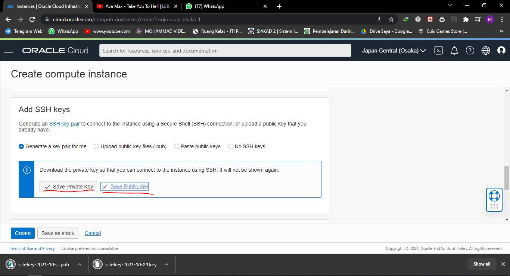

# 09 - Ujian Tengah Semester

## Hasil Praktikum

1.	Membuat Instance Compute sebagai server

a.	Login ke akun Oracle Cloud

b.	Pada beranda Oracle Cloud pilih menu di pojok kiri atas, kemudian pilih menu Compute > Instances

c.	Memilih Create Instance untuk membuat VM baru

d.	Beri nama VM sesuai dengan keinginan. Untuk compartment biarkan secara default dan placement pastikan Always Free-eligible (biasanya secara default sudah terpilih jadi tidak perlu diatur lagi)

e.	Pada bagian Image and shape atur system operasi yang akan digunakan, ubah menjadi ubuntu dengan cara klik Edit. Untuk bagian shape dibiarkan saja, secara default biasanya menggunakan AMD VM.Standard.E2.1.Micro Always Free-eligible dengan 1 core CPU dan 1 GB RAM.

f.	Pada bagian Networking biarkan saja peraturannya. Secara default, akses SSH port 21 sudah bisa diakses.

g.	Pada bagian SSH keys perlu klik Save Private Key untuk mengunduh private key milik kita agar nanti VM bisa diakses.

h.	Atur disk sesuai dengan kebutuhan, kemudian yang terakhir adalah klik Create di pojok kiri bawah untuk memulai membuat VM.

i.	Tunggu prosesnya sekitar 2-5 menit sampil tampil state VM kita telah running

