# 11 - Docker 2

## Hasil Praktikum

1.	Docker Network

1.	Docker Network
Pada praktikum yang pertama akan melakukan pembuatan network pada docker agar container yang dibuat bisa terhubung ke server lain atau berkomunikasi dengan dunia luar, dan juga container yang lain.

1.1	Membuat dan Memeriksa Docker Network

Beberapa perintah yang dapat digunakan adalah sebagai berikut

•	Pertama ketik perintah di bawah ini untuk mengetahui network yang tersedia pada docker host kita

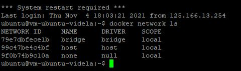

•	Selanjutnya untuk mengetahui perintah-perintah dasar yang bisa digunakan untuk docker network

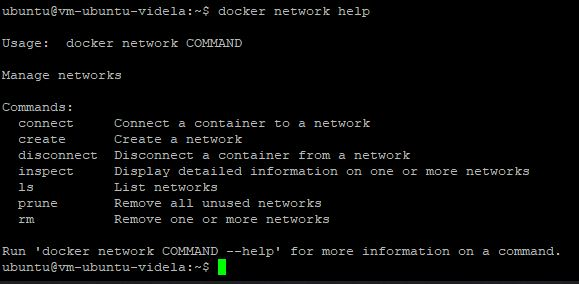

•	Untuk membuat network bisa menggunakan perintah create seperti pada gambar di bawah ini

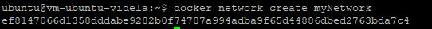

•	Selanjutnya cek network yang sudah dibuat menggunkan perintah ls, seharusnya akan menambahkan network. Hasilnya adalah sebagai berikut

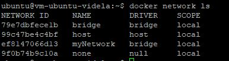

•	Terakhir, ketika ingin mengetahui informasi detail dari network yang telah kita buat bisa menggunakan perintah inspect

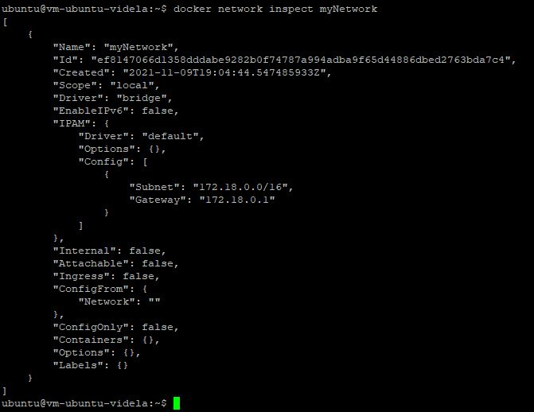

Dari praktikum pertama kita telah membuat network yaitu myNetwork, network tersebut selanjutnya bisa digunakan untuk menghubungkan container satu dengan yang lain.

1.2	Menghubungkan Container ke Network

Silakan menjalankan perintah-perintah di bawah ini untuk memanfaatkan network yang sebelumnya telah kita buat

•	Buat terlebih dahulu contoh container, misalkan kita akan membuat container linux yaitu busybox.

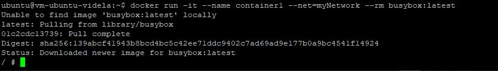

•	Buat container yang kedua menggunakan image linux alphine, buka windows yang baru agar container1 tetap berjalan

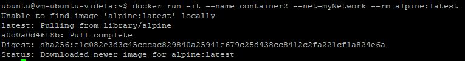

•	Kemudian cek masing-masing container tersebut menggunakan perintah ps untuk mengetahui status container yang sedang jalan. Buka windows baru, jalankan perintah berikut

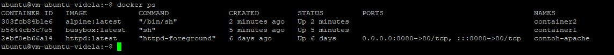

•	Kemudian jalankan inspect untuk mengetahui informasi detail dari masing-masing container.

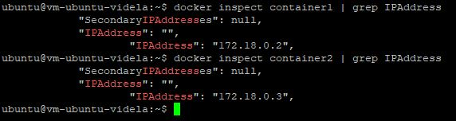

•	Untuk membuktikan silakan ping dari container1 ke container2, seharusnya akan reply.

Setelah melakukan konfigurasi network selanjutnya bisa dimanfaatkan untuk diimplementasikan pada image aplikasi yang kita buat sendiri.

1.3	Membuka Port Container

Scenario yang umum sering kita lakukan agar aplikasi dapat menerima request adalah dengan mengizinkan akses pada port tertentu, sama halnya dengan container. Harus dilakukan expose agar dapat menerima request dari lingkungan luar, beberapa hal yang dapat dilakukan adalah sebagai berkut

•	Misalkan kita ingin membuat image dari apache, layanan httpd. Bisa dilakukan dengan perintah di bawah ini

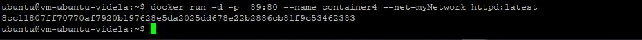

•	Silakan cek menggunakan telnet terhadap port yang di-expose, seharusnya akan menghasilkan output seperti berikut

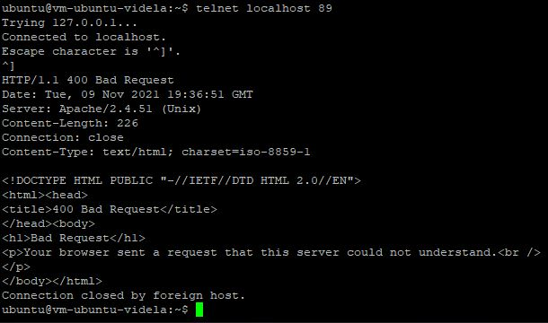

•	Atau Anda bisa ngetik pada browser seperti ditunjukkan di bawah ini

•	Kemudian untuk mengetahui port yang dilakukan expose pada container, bisa menggunakan perintah di bawah ini

Setelah mengetahui cara untuk melakukan expose dan mapping port, dapat diterapkan ketika Anda membuat container dan container tersebut bisa menerima request dari luar.

2.	Docker Volume

Ketika kita membuat container dan dalam keadaan tertentu data-data yang terdapat container tersebut harus tetap dipertahankan walaupun container sudah dihapus, hal ini tetap bisa dilakukan dengan konsep persistent storage.

2.1.	Membuat Volume

Ada beberapa scenario yang bisa dilakukan, yaitu membuat volume di host container untuk di-share ke semua container dan membuat volume di docker untuk di-share ke semua container.

•	Buat terlebih dahulu folder di host(laptop/computer/vps), misalkan saya buat folder docker-shared.

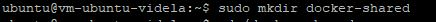