# 11 - Docker 2

## Hasil Praktikum

1. Hosting Static Website Menggunakan CI/CD Pipeline

Pada praktikum yang pertama akan dilakukan hosting static website di layanan Object Storage dari Oracle menggunakan GitHub Actions.

1.1. Menyiapkan Bucket Object Storage

a. Masuk ke akun https://cloud.oracle.com dan navigasi ke menu Storage -> Buckets

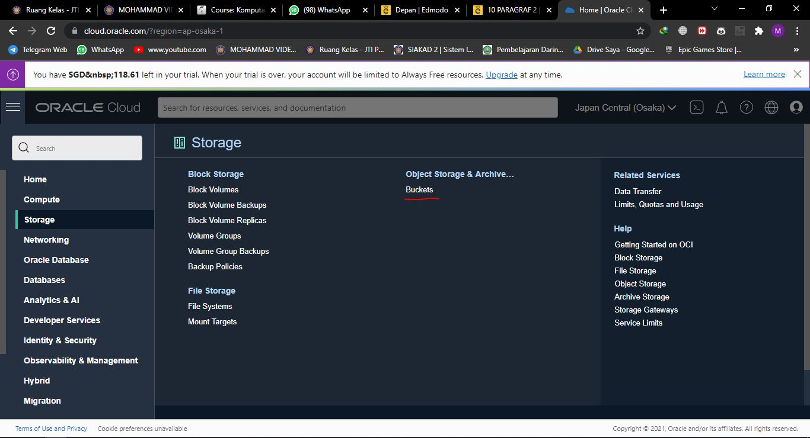

b. Tekan tombol Create Bucket, dan lengkapi Bucket Name dengan os-react. Biarkan nilai lainnya dengan nilai default kemudian tekan tombol Create.

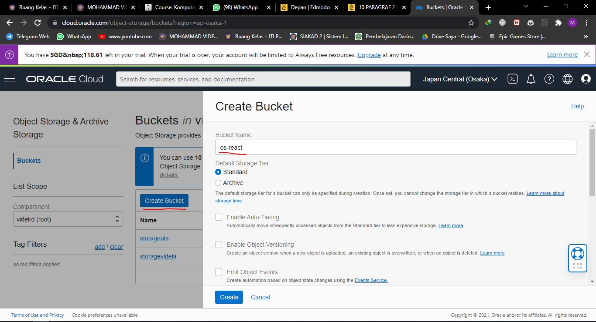

c. Ubah visibility bucket dengan menekan tombol Edit Visibility, dan ubah menjadi public. Tekan tombol Save Changes untuk menyimpan perubahan.

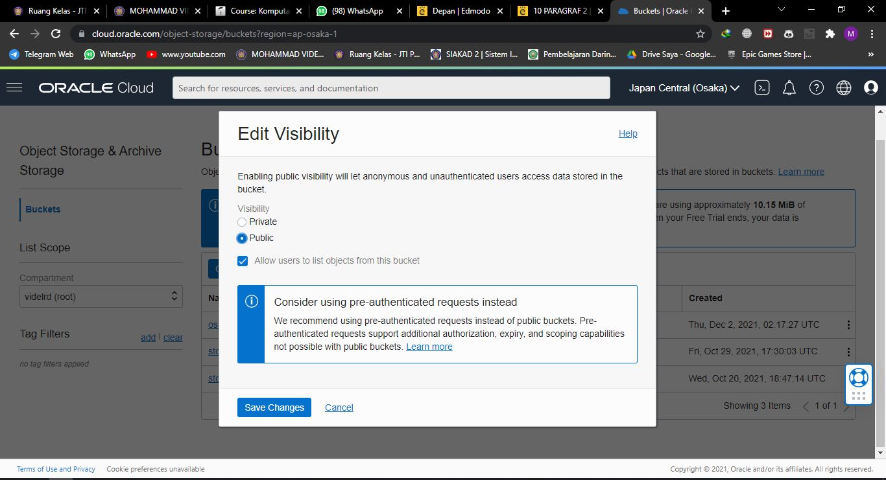

d. Pada dashboard bucket, perhatikan nilai Namespace. Nilai ini nanti akan digunakan untuk pengaturan deployment.

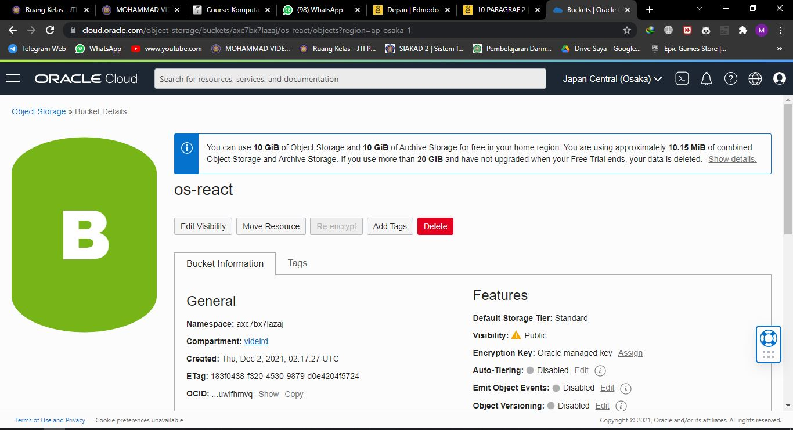

1.2. Menyiapkan Project

a. Pada praktikum ini, akan digunakan React sehingga harus diinstall terlebih dahulu Node. Untuk langkah instalasi Node silahkan gunakan tautan berikut sebagai referensi https://nodejs.org/en/download/ atau https://nodejs.org/en/download/package-manager/

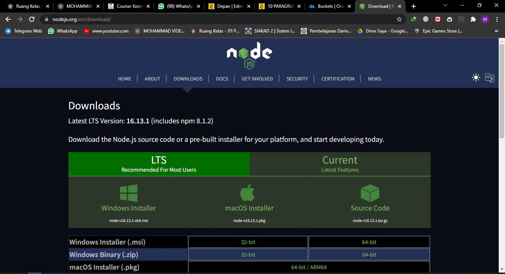

b. Setelah Node terinstall, silahkan lakukan Langkah generate project dengan menggunakan perintah berikut.

npx create-react-app os-react

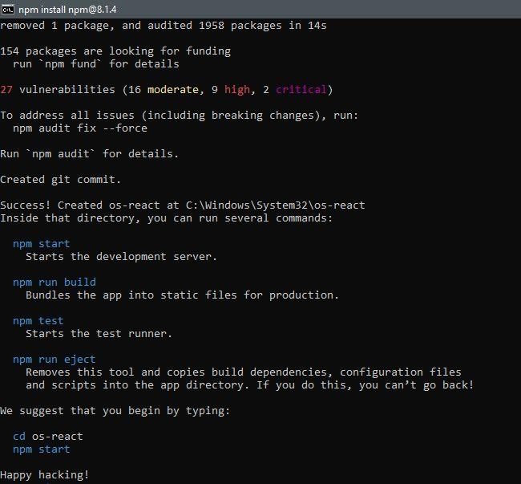

c. Buatlah repository pada GitHub kemudian push project tersebut ke dalam repository.

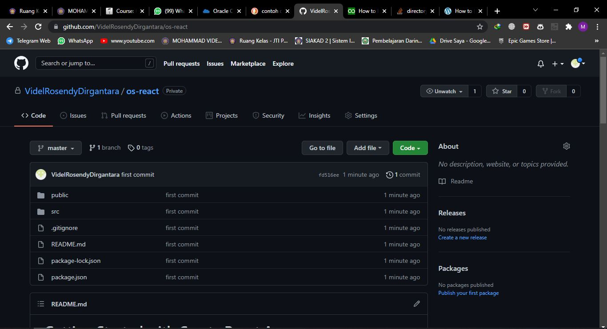

1.3. Menambahkan GitHub Workflow

A. Pipeline CI/CD pada GitHub dibuat dengan format yaml dan diletakkan pada lokasi .github/workflows. Buatlah file yaml pada lokasi tersebut, sebagai ilustrasi silahkan perhatikan filename berikut

.github/workflows/build.yml

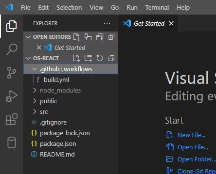

b. Salin konfigurasi pipeline berikut.

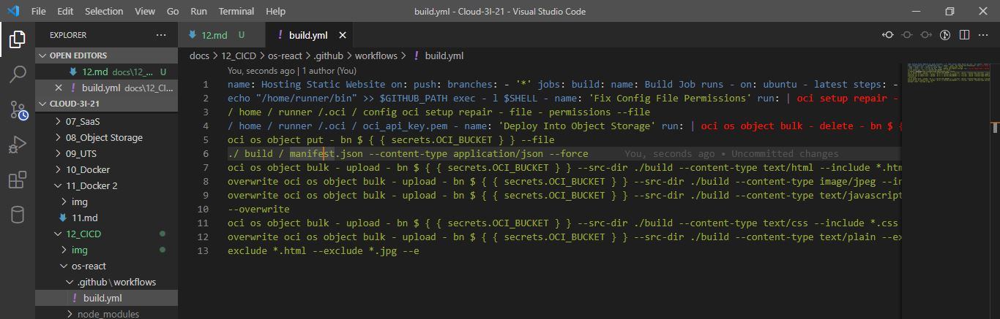

c. Pada pengaturan pipeline, terdapat nilai secrets yang diatur melalui pengaturan pada
repository GitHub.

d. Buka alamat repository GitHub, dan masuk ke menu Settings -> Secrets

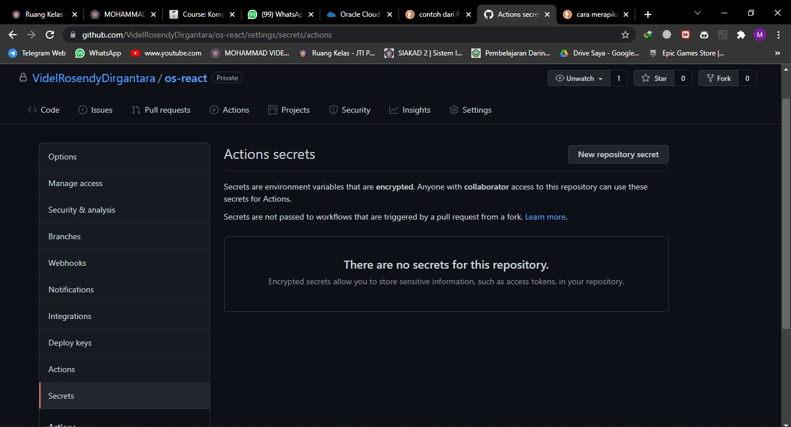

e. Sebagai panduan, silahkan gunakan table berikut untuk pengisian secrets

f. Lengkapi nilai semua secrets yang dibutuhkan. Kemudian push perubahan ke repository GitHub.

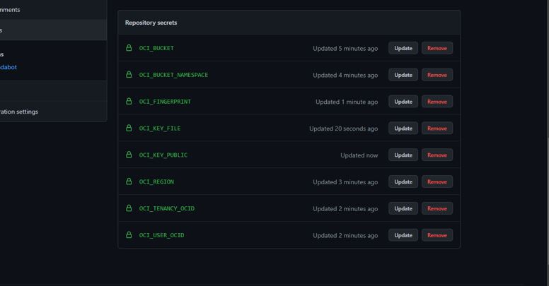

g.	Perhatikan tab Actions pada halaman repository. Cek hasil proses deployment apakah terdapat kesalahan. Jika terjadi kesalahan, koreksi kembali nilai secrets yang dimasukkan.

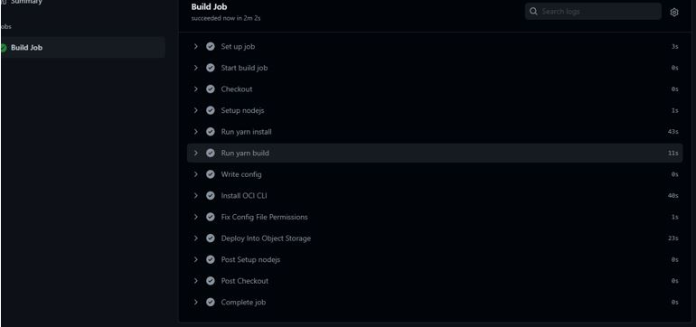

h.	Jika proses deployment sudah mendapatkan tanda centang hijau, silahkan kembali ke dashboard bucket object storage. Centang berkas index.html, kemudian tekan menu titik tiga dan pilih View Object Details. Perhatikan URL Path dengan pola sebagai berikut https://objectstorage.<region>.oraclecloud.com/n/<namespace>/b/<bucket-name>/o/index.html.

i.	Salin URL Path tanpa nilai index.html, kemudian buka kembali project React. Cari berkas package.json dan tambahkan key “homepage” dengan nilai URL Path pada Object Details. Ilustrasi berkas hasil akhir package.json dapat dilihat sebagai berikut.

j.	Jika mengalami kesulitan, silahkan gunakan repository https://github.com/dhanifudin/hello-react sebagai rujukan.

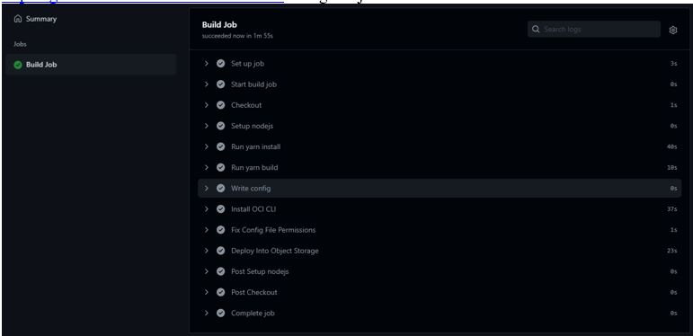

2.	Deploy Simple Website Menggunakan Docker CI/CD Pipeline

2.1.	Menyiapkan Project Repository

a.	Buat baru project React dengan memasukkan perintah

npx create-react-app docker-react

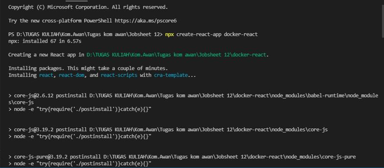
 
b.	Buatlah project baru pada GitHub, dan push project React tersebut.

2.2.	Menyiapkan Akses Docker Hub

a.	Silahkan login pada akun Docker pada https://hub.docker.com

b.	Untuk memberikan akses push ke dalam registry, perlu dibuat Access Token. Silahkan masuk pada halaman https://hub.docker.com/settings/security kemudian tekan tombol New Access Token.

c.	Masukkan GitHub Actions pada nama token, simpan nilai token yang telah didapatkan.

2.3.	Menambahkan GitHub Workflow

a.	Buat sebuah file dengan berkas yaml, pada lokasi .github/workflows/deploy.yml.

b.	Unduh konfigurasi berkas pada tautan https://github.com/dhanifudin/hello-react-docker/raw/master/.github/workflows/deploy.yml dan simpan pada lokasi tersebut.

c.	Tambahkan nilai-nilai secrets yang terdapat pada GitHub Workflow tersebut. Untuk nilai yang diawali prefix OCI_ dapat digunakan table sebelumnya sebagai referensi.

d.	Perhatikan table berikut sebagai referensi untuk pengisian nilai secrets

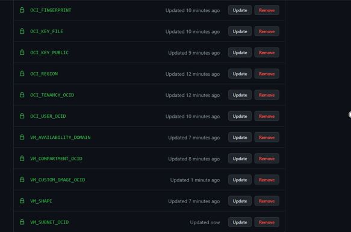
 
2.4.	Menyiapkan Dockerfile

a.	Buatlah berkas dengan nama Dockerfile. Gunakan tautan berikut https://github.com/dhanifudin/hello-react-docker/blob/master/Dockerfile sebagai template.

b.	Pastikan penamaan berkas sudah sesuai.

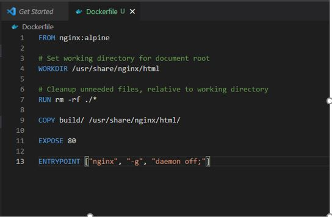
 
2.5.	Menyiapkan Docker Compose

a.	Buatlah berkas dengan nama docker-compose.yml

b.	Gunakan tautan https://github.com/dhanifudin/hello-react-docker/blob/master/docker-compose.yml sebagai referensi untuk membuat docker-compose.yml. Jangan lupa untuk mengubah nilai image sesuai dengan username docker hub.
 
2.6.	Melakukan Deployment

a.	Setelah berkas deployment dan nilai secrets telah selesai diatur, lakukan push ke repository.

b.	Amati log deployment pada tab Actions, dan pastikan proses menghasilkan tanda centang hijau. Jika terjadi error, periksa kembali konfigurasi dan nilai secrets yang dimasukkan.

c.	Setelah proses deployment berhasil, untuk mendapatkan nilai IP public yang dapat diakses silahkan masuk ke dashboard pada halaman Compute Instances.

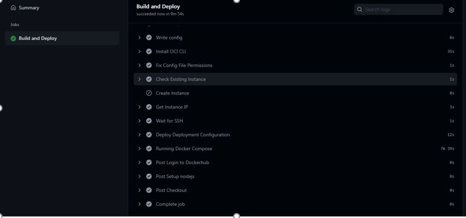
 
d.	Pada hasil akhir, jika tidak terdapat kesalahan akan didapatkan halaman website seperti pada gambar berikut.

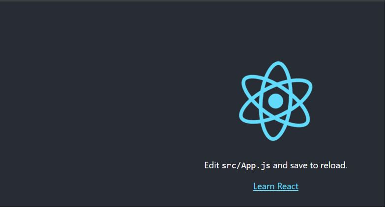