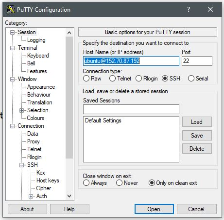
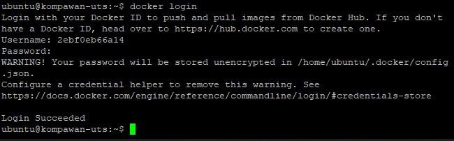
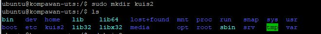
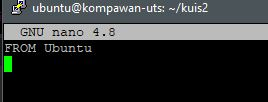
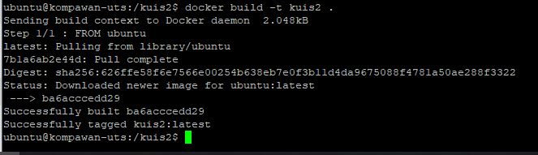
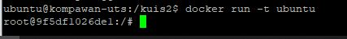
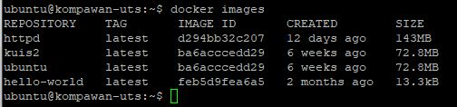
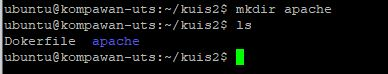
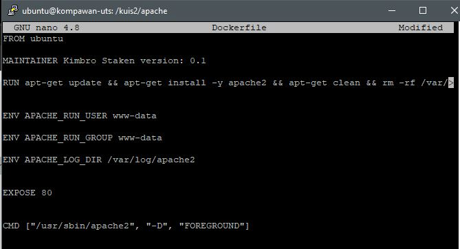
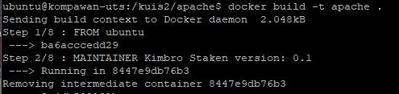

# 13 - Kuis 2

## Hasil Praktikum

1. Login melalu putty dengan IP Address dan Private Key yang pernah disimpan

2. Pastikan sudah login ke akun docker yang telah dibuat

3. Buat Folder baru

4. Masuk ke dalam file yang telah dibuat lalu tambahkan sebuah file bernama dockerfile dengan perintah berikut dan isikan sebagai berikut

5. Buat build image baru

6. Bisa kita cek dengan perintah berikut apakah image sudah terbuat dan dapat dijalankan

7. atau bisa dilihat dengan perintah berikut

8. Selanjutnya kita buat sebuah folder yang akan diisi untuk apache

9. lalu kita buat sebuah file dengan nama Dockerfile dan kita dit isinya seperti berikut

10. build image baru untuk apache

