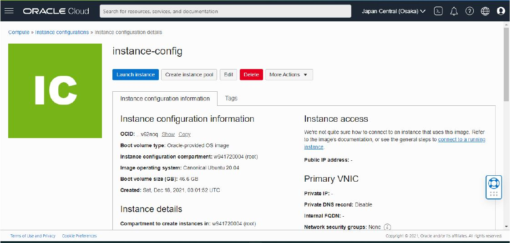

# 15 - Autoscalling infrastruktur

## Hasil Praktikum

3.	Membuat Konfigurasi Instance

Kita akan gunakan instance yang telah kita miliki sebagai template untuk konfigurasi instance. Jika belum memiliki instance, buatlah instance komputasi seperti yang telah dilakukan pada pertemuan awal.

1.	Pada halaman detail instance, klik menu More Actions dan pilih Create Instance Configuration.

2.	Pilih kompartemen Anda Untuk nama, masukkan instance-config.

3.	Click Create Instance Configuration.

Setelah Anda membuat konfigurasi instance, halaman detailnya akan ditampilkan, seperti yang ditunjukkan pada gambar berikut.

 
4.	Membuat instance pool

Anda dapat membuat kolam instans langsung dari halaman konfigurasi instans dengan mengikuti langkah-langkah berikut:

1.	klik Create Instance pool

2.	Dari daftar Kompartemen, pilih kompartemen tempat Anda membuat konfigurasi instans. Untuk nama, masukkan my-instance-pool. Dari daftar Konfigurasi Instance, pilih instance-config.	Untuk number of instans, masukkan 3. Jumlah instans menunjukkan jumlah maksimum instans yang dapat disediakan di kolam instans. Jumlah instans yang dapat disediakan bergantung pada batas layanan penyewa Anda dan ketersediaan bentuk komputasi di wilayah Anda. Klik next

Pada halaman Configure Pool Placement, Anda dapat menambahkan satu atau beberapa availability  domain. Untuk setiap domain, Anda dapat menentukan fault  domain, primary virtual cloud network (VCN), dan subnet. Secara default, instans dalam kolam didistribusikan di semua fault  domain. Jika kapasitas tidak tersedia di satu fault  domain, instans ditempatkan di fault  domain lain untuk memungkinkan kumpulan instans berhasil diluncurkan. Anda dapat meminta agar instans didistribusikan secara merata di setiap fault  domain yang Anda pilih untuk skenario ketersediaan tinggi.

Selain itu, Anda dapat mengaitkan loadbalancer dengan kumpulan instans dengan memilih kotak centang Lampirkan loadbalancer. Untuk menggunakan fitur ini, Anda harus memiliki loadbalancer dulu.
Untuk melanjutkan, pilih AD1 untuk availability domain, VCN dan subnet. Klik Next  dan kemudian Create  untuk membuat kolam instans.
 
Untuk fault domain pilih FAULT-DOMAIN-1, FAULT-DOMAIN-2, FAULT-DOMAIN-3
Karena ada keterbatasan layanan penyewa nampaknya instance bisa dibuat hanya 1 buah.
 
5.	Membuat konfigurasi Autoscalling

Skenarionya adalah barangkali suatu saat instans yang ada tidak dapat menangani kebutuhan komputasi. Maka dibuat konfigurasi penskalaan otomatis yang secara otomatis menskalakan jumlah instans di kolam instance.
Kita akan buat konfigurasi penskalaan otomatis dari halaman detail instance pool.

1.	Klik menu More Actions dan pilih Create Autoscaling Configuration.

2.	Untuk nama, masukkan my-autoscaling-config.

3.	Dari daftar Buat di kompartemen, pilih kompartemen tempat Anda membuat kumpulan instans.

4.	Klik Next.
 
Pada halaman Configure Autoscaling Policy, Anda dapat memilih Metric-based Autoscaling atau Schedule-based Autoscaling. 

Metric-based Autoscaling penskalaan otomatis berbasis metrik, seperti CPU atau penggunaan memori untuk memicu peristiwa penskalaan otomatis. Anda kemudian dapat menentukan aturan scale-out dan scale-in. Aturan ini mengambil persentase ambang batas. Untuk memastikan bahwa instance tidak ditambahkan atau dihapus terlalu cepat, pengaturan cooldown dalam detik memastikan waktu minimum antara peristiwa pen-skalaan (300 detik, atau 5 menit). Gambar berikut menunjukkan contoh aturan penskalaan otomatis berbasis penggunaan CPU. Kebijakan ini menambahkan satu  instance saat penggunaan CPU lebih besar dari 70%. Saat penggunaan CPU turun di bawah 40%, kebijakan penskalaan otomatis menghapus satu instans.

Metric-based Autoscaling digunakan saat Anda tidak dapat memprediksi jumlah lalu lintas, dan Anda ingin mengotomatiskan penskalaan berdasarkan penggunaan CPU atau memori. Ketika Anda dapat memprediksi permintaan atau Anda tahu bahwa peningkatan permintaan akan terjadi (acara peluncuran, misalnya), Anda menggunakan Schedule-based Autoscaling.

Contoh Penskalaan otomatis berbasis3gunaan CPU
 
Schedule-based Autoscaling. Misalnya, Anda merencanakan serangkaian acara peluncuran yang terjadi setiap hari Senin pukul 14.00, dari Januari hingga Maret. Anda ingin memastikan bahwa Anda memiliki 10 instans yang berjalan pada waktu tersebut. Gambar berikut menunjukkan cara mengonfigurasi kebijakan tersebut dengan menyetel ukuran kumpulan target ke 10 dan memasukkan nilai untuk menit (0), jam (14), hari dalam sebulan (?), bulan (1-3), hari minggu (2), dan tahun (*).
 
5.	Setelah Anda mengonfigurasi Autoscalling policy, klik Create. Anda dapat menentukan beberapa konfigurasi penskalaan otomatis untuk kumpulan instance yang sama, dan Anda dapat mengaktifkan atau menonaktifkannya salah satunya.
